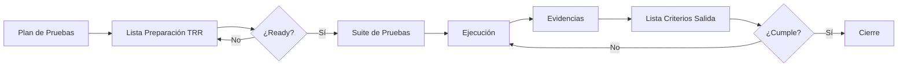
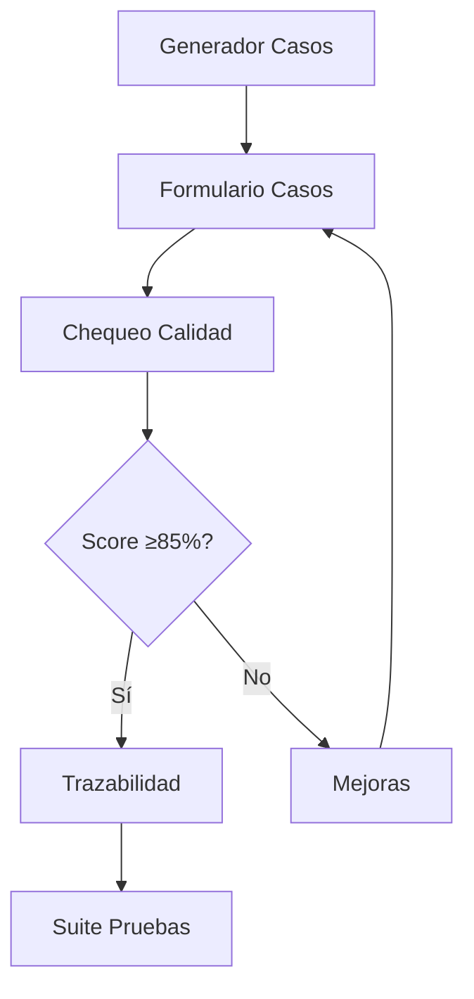
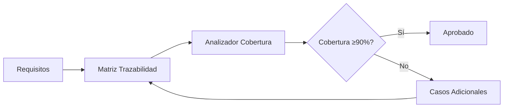

# 📊 SISTEMA IBM QUALITY MANAGEMENT - MAPEO COMPLETO

**Fecha de Actualización**: 3 de Octubre de 2025  
**Versión**: 2.0 - Sistema Completo con Hojas de Control  
**Autor**: IBM QMS Team  

---

## 🎯 RESUMEN EJECUTIVO

### Estadísticas del Sistema
| Métrica | Valor |
|---------|-------|
| **Total Herramientas HTML** | **32** |
| **Hojas de Control Integradas** | **5** ✨ |
| **Roles Definidos** | **5** |
| **Estándares Implementados** | **6** |
| **Dashboards** | **5** |
| **Herramientas de Testing** | **12** |
| **Gestión de Defectos** | **4** |
| **Gestión y Control** | **11** (5 nuevas) |
| **Reportes y Analytics** | **6** |

### Estándares Implementados
- ✅ **CMMI Level 3** - Capability Maturity Model Integration
- ✅ **TMMi Level 3** - Test Maturity Model Integration
- ✅ **ISO/IEC 25010** - Calidad del Producto de Software
- ✅ **IEEE 829** - Standard for Software Test Documentation
- ✅ **Six Sigma** - Metodología de mejora de procesos
- ✅ **ITIL** - Information Technology Infrastructure Library

---

## 👨‍💼 ROL: ADMINISTRADOR (Admin)
**Acceso**: 30+ vistas | **Descripción**: Control total del sistema QMS

### 📊 DASHBOARDS (5)
| # | Archivo | Estándares | Descripción | Favicon |
|---|---------|-----------|-------------|---------|
| 1 | `dashboard_integrado_ibm.html` | CMMI, TMMi, ISO/IEC 25010 | Dashboard principal con visión 360° del QMS | 🏠 |
| 2 | `dashboard_ejecutivo_ibm.html` | Six Sigma, CMMI | Vista estratégica para stakeholders y directivos | 📈 |
| 3 | `dashboard_calidad_ibm.html` | ISO/IEC 25010, TMMi | Métricas de calidad en tiempo real | ✓ |
| 4 | `dashboard_testing_metrics_ibm.html` | TMMi Level 3, IEEE 829 | Métricas específicas de testing y ejecución | 🧪 |
| 5 | `ml_quality_analytics_dashboard.html` | ISO/IEC 25010, ML/AI | Analítica predictiva con Machine Learning | 🤖 |

### 🔧 HERRAMIENTAS DE ANÁLISIS (6)
| # | Archivo | Estándares | Descripción | Favicon |
|---|---------|-----------|-------------|---------|
| 6 | `informe_herramientas_ibm.html` | CMMI, ITIL | Catálogo completo de herramientas QMS | 📊 |
| 7 | `estrategia_pruebas_ibm.html` | TMMi Level 3, IEEE 829 | Definición de estrategia de testing | 🎯 |
| 8 | `checklist_configuracion_ibm.html` | CMMI Level 3 | Verificación de configuración del sistema | ✅ |
| 9 | `calculadora_metricas_calidad_ibm.html` | ISO/IEC 25010, Six Sigma | Cálculo automatizado de métricas | 🔢 |
| 10 | `analizador_cobertura_ibm.html` | TMMi Level 3 | Análisis de cobertura de pruebas | 📊 |
| 11 | `analisis_riesgos_calidad_ibm.html` | CMMI, ISO 31000 | Gestión y análisis de riesgos | ⚠️ |

### 🧪 TESTING Y CASOS DE PRUEBA (5)
| # | Archivo | Estándares | Descripción | Favicon |
|---|---------|-----------|-------------|---------|
| 12 | `generador_casos_prueba_ibm.html` | IEEE 829, TMMi | Generación automática de casos de prueba | 📝 |
| 13 | `generador_casos_caja_negra_blanca_ibm.html` | IEEE 829 | Casos por técnica (Black Box/White Box) | ⚫ |
| 14 | `formulario_casos_prueba_ibm.html` | IEEE 829, TMMi Level 3 | Formulario estandarizado IEEE 829 | 📋 |
| 15 | `plan_pruebas_template_ibm.html` | IEEE 829 | Template plan maestro de pruebas | 📄 |
| 16 | `reporte_ejecucion_pruebas_ibm.html` | IEEE 829, TMMi | Reporte detallado de ejecución | 📊 |

### 🐛 GESTIÓN DE DEFECTOS (4)
| # | Archivo | Estándares | Descripción | Favicon |
|---|---------|-----------|-------------|---------|
| 17 | `sistema_gestion_defectos_ibm.html` | CMMI Level 3 | Sistema central de gestión de defectos | 🐛 |
| 18 | `vista_tester_defectos_ibm.html` | IEEE 829 | Vista específica para testers | 👨‍💻 |
| 19 | `vista_desarrollador_defectos_ibm.html` | CMMI | Vista para desarrolladores | 👨‍💼 |
| 20 | `vista_project_manager_defectos_ibm.html` | CMMI, ITIL | Vista para project managers | 👔 |

### 📐 GESTIÓN Y CONTROL (11) ✨ **5 NUEVAS**
| # | Archivo | Estándares | Descripción | Favicon |
|---|---------|-----------|-------------|---------|
| 21 | `hoja_control_proyecto_ibm.html` | CMMI Level 3 | Control de versiones y cambios del proyecto | 📋 |
| 22 | ✨ `lista_verificacion_criterios_salida_ibm.html` | **TMMi Level 3, CMMI, IEEE 829** | **15 criterios de salida por fase del ciclo de vida** | ✅ |
| 23 | ✨ `lista_verificacion_preparacion_pruebas_ibm.html` | **TMMi Level 3, CMMI, IEEE 829, ITIL** | **Test Readiness Review (TRR) - 18 items de preparación** | 🚀 |
| 24 | ✨ `plantilla_suite_pruebas_evidencias_ibm.html` | **IEEE 829, TMMi Level 3, CMMI** | **Suite completa de casos con evidencias y ejecución** | 🧪 |
| 25 | ✨ `lista_chequeo_calidad_casos_prueba_ibm.html` | **TMMi Level 3, CMMI, IEEE 829** | **RD-181 Evaluación de calidad (18 criterios)** | ⭐ |
| 26 | ✨ `plantilla_trazabilidad_pruebas_ibm.html` | **IEEE 829, TMMi Level 3, CMMI** | **Matriz de trazabilidad Requirements ↔ Test Cases** | 🔗 |
| 27 | `matriz_raci_ibm.html` | CMMI, ITIL | Matriz de responsabilidades RACI | 📊 |
| 28 | `gestion_ambientes_ibm.html` | ITIL, CMMI | Gestión de ambientes de prueba | 🌍 |
| 29 | `sistema_trazabilidad_ibm.html` | IEEE 829, CMMI | Sistema de trazabilidad completo | 🔗 |
| 30 | `templates_automatizacion_ibm.html` | TMMi Level 3 | Templates para automatización de pruebas | ⚙️ |
| 31 | `herramienta_limpieza_datos_ibm.html` | CMMI | Herramienta de limpieza de datos de prueba | 🧹 |

---

## 📊 ROL: MANAGER (Project Manager)
**Acceso**: 12 vistas | **Descripción**: Gestión y supervisión de proyectos QA

### 📊 DASHBOARDS (3)
| # | Archivo | Estándares | Descripción | Favicon |
|---|---------|-----------|-------------|---------|
| 1 | `dashboard_ejecutivo_ibm.html` | Six Sigma, CMMI | Métricas ejecutivas y KPIs | 📈 |
| 2 | `dashboard_calidad_ibm.html` | ISO/IEC 25010, TMMi | Dashboard de calidad | ✓ |
| 3 | `vista_project_manager_defectos_ibm.html` | CMMI, ITIL | Gestión de defectos del proyecto | 👔 |

### 📐 GESTIÓN (9) ✨ **5 NUEVAS**
| # | Archivo | Estándares | Descripción | Favicon |
|---|---------|-----------|-------------|---------|
| 4 | `hoja_control_proyecto_ibm.html` | CMMI Level 3 | Control del proyecto | 📋 |
| 5 | ✨ `lista_verificacion_criterios_salida_ibm.html` | **TMMi Level 3, CMMI, IEEE 829** | **Validación de criterios de salida** | ✅ |
| 6 | ✨ `lista_verificacion_preparacion_pruebas_ibm.html` | **TMMi Level 3, CMMI, IEEE 829, ITIL** | **TRR - Test Readiness Review** | 🚀 |
| 7 | ✨ `plantilla_suite_pruebas_evidencias_ibm.html` | **IEEE 829, TMMi Level 3** | **Gestión de suite de pruebas** | 🧪 |
| 8 | ✨ `lista_chequeo_calidad_casos_prueba_ibm.html` | **TMMi Level 3, CMMI, IEEE 829** | **Evaluación de calidad de casos** | ⭐ |
| 9 | ✨ `plantilla_trazabilidad_pruebas_ibm.html` | **IEEE 829, TMMi Level 3, CMMI** | **Matriz de trazabilidad completa** | 🔗 |
| 10 | `matriz_raci_ibm.html` | CMMI, ITIL | RACI del proyecto | 📊 |
| 11 | `sistema_trazabilidad_ibm.html` | IEEE 829, CMMI | Trazabilidad de requisitos | 🔗 |
| 12 | `gestion_ambientes_ibm.html` | ITIL, CMMI | Control de ambientes | 🌍 |
| 13 | `plan_pruebas_template_ibm.html` | IEEE 829 | Plan maestro de pruebas | 📄 |

### 📊 REPORTES (4)
| # | Archivo | Estándares | Descripción | Favicon |
|---|---------|-----------|-------------|---------|
| 14 | `informe_herramientas_ibm.html` | CMMI, ITIL | Inventario de herramientas | 📊 |
| 15 | `estrategia_pruebas_ibm.html` | TMMi Level 3, IEEE 829 | Estrategia definida | 🎯 |
| 16 | `reporte_ejecucion_pruebas_ibm.html` | IEEE 829, TMMi | Resultados de ejecución | 📊 |
| 17 | `analisis_riesgos_calidad_ibm.html` | CMMI, ISO 31000 | Análisis de riesgos | ⚠️ |

---

## 📈 ROL: ANALISTA (Quality Analyst)
**Acceso**: 11 vistas | **Descripción**: Análisis y métricas de calidad

### 📊 DASHBOARDS (3)
| # | Archivo | Estándares | Descripción | Favicon |
|---|---------|-----------|-------------|---------|
| 1 | `dashboard_calidad_ibm.html` | ISO/IEC 25010, TMMi | Dashboard de calidad | ✓ |
| 2 | `dashboard_testing_metrics_ibm.html` | TMMi Level 3, IEEE 829 | Métricas de testing | 🧪 |
| 3 | `ml_quality_analytics_dashboard.html` | ISO/IEC 25010, ML/AI | Analytics predictivo | 🤖 |

### 🔧 ANÁLISIS (9) ✨ **4 NUEVAS**
| # | Archivo | Estándares | Descripción | Favicon |
|---|---------|-----------|-------------|---------|
| 4 | `hoja_control_proyecto_ibm.html` | CMMI Level 3 | Seguimiento del proyecto | 📋 |
| 5 | ✨ `lista_verificacion_criterios_salida_ibm.html` | **TMMi Level 3, CMMI, IEEE 829** | **Verificación de criterios** | ✅ |
| 6 | ✨ `plantilla_suite_pruebas_evidencias_ibm.html` | **IEEE 829, TMMi Level 3** | **Análisis de suite de pruebas** | 🧪 |
| 7 | ✨ `lista_chequeo_calidad_casos_prueba_ibm.html` | **TMMi Level 3, CMMI, IEEE 829** | **Evaluación de calidad técnica** | ⭐ |
| 8 | ✨ `plantilla_trazabilidad_pruebas_ibm.html` | **IEEE 829, TMMi Level 3, CMMI** | **Análisis de trazabilidad** | 🔗 |
| 9 | `calculadora_metricas_calidad_ibm.html` | ISO/IEC 25010, Six Sigma | Cálculo de métricas | 🔢 |
| 10 | `analizador_cobertura_ibm.html` | TMMi Level 3 | Análisis de cobertura | 📊 |
| 11 | `analisis_riesgos_calidad_ibm.html` | CMMI, ISO 31000 | Gestión de riesgos | ⚠️ |
| 12 | `sistema_trazabilidad_ibm.html` | IEEE 829, CMMI | Trazabilidad completa | 🔗 |

### 📊 REPORTES (2)
| # | Archivo | Estándares | Descripción | Favicon |
|---|---------|-----------|-------------|---------|
| 13 | `reporte_ejecucion_pruebas_ibm.html` | IEEE 829, TMMi | Reporte de ejecución | 📊 |
| 14 | `reporte_ejecucion_ml_analytics.html` | ML/AI, ISO/IEC 25010 | Reporte ML Analytics | 🤖 |

---

## 🧪 ROL: TESTER (QA Tester)
**Acceso**: 9 vistas | **Descripción**: Ejecución y documentación de pruebas

### 🧪 TESTING (8) ✨ **4 NUEVAS**
| # | Archivo | Estándares | Descripción | Favicon |
|---|---------|-----------|-------------|---------|
| 1 | `vista_tester_defectos_ibm.html` | IEEE 829 | Gestión de defectos | 👨‍💻 |
| 2 | ✨ `lista_verificacion_preparacion_pruebas_ibm.html` | **TMMi Level 3, CMMI, IEEE 829, ITIL** | **Checklist pre-ejecución (TRR)** | 🚀 |
| 3 | ✨ `plantilla_suite_pruebas_evidencias_ibm.html` | **IEEE 829, TMMi Level 3** | **Ejecución y registro de evidencias** | 🧪 |
| 4 | ✨ `lista_chequeo_calidad_casos_prueba_ibm.html` | **TMMi Level 3, CMMI, IEEE 829** | **Validación de calidad de casos** | ⭐ |
| 5 | ✨ `plantilla_trazabilidad_pruebas_ibm.html` | **IEEE 829, TMMi Level 3, CMMI** | **Verificación de trazabilidad** | 🔗 |
| 6 | `generador_casos_prueba_ibm.html` | IEEE 829, TMMi | Creación de casos de prueba | 📝 |
| 7 | `generador_casos_caja_negra_blanca_ibm.html` | IEEE 829 | Casos Black Box / White Box | ⚫ |
| 8 | `formulario_casos_prueba_ibm.html` | IEEE 829, TMMi Level 3 | Formulario de casos | 📋 |

### 🐛 DEFECTOS (2)
| # | Archivo | Estándares | Descripción | Favicon |
|---|---------|-----------|-------------|---------|
| 9 | `sistema_gestion_defectos_ibm.html` | CMMI Level 3 | Registro de defectos | 🐛 |
| 10 | `vista_desarrollador_defectos_ibm.html` | CMMI | Vista de desarrollo | 👨‍💼 |

### 📊 REPORTES (2)
| # | Archivo | Estándares | Descripción | Favicon |
|---|---------|-----------|-------------|---------|
| 11 | `dashboard_testing_metrics_ibm.html` | TMMi Level 3, IEEE 829 | Métricas de testing | 🧪 |
| 12 | `reporte_ejecucion_pruebas_ibm.html` | IEEE 829, TMMi | Reporte de ejecución | 📊 |

---

## 👁️ ROL: VIEWER (Visualizador)
**Acceso**: 5 vistas | **Descripción**: Solo lectura de dashboards y reportes

### 📊 DASHBOARDS (2)
| # | Archivo | Estándares | Descripción | Favicon |
|---|---------|-----------|-------------|---------|
| 1 | `dashboard_testing_metrics_ibm.html` | TMMi Level 3, IEEE 829 | Métricas de testing | 🧪 |
| 2 | `dashboard_calidad_ibm.html` | ISO/IEC 25010, TMMi | Dashboard de calidad | ✓ |

### 📊 REPORTES (3)
| # | Archivo | Estándares | Descripción | Favicon |
|---|---------|-----------|-------------|---------|
| 3 | `informe_herramientas_ibm.html` | CMMI, ITIL | Catálogo de herramientas | 📊 |
| 4 | `estrategia_pruebas_ibm.html` | TMMi Level 3, IEEE 829 | Estrategia de pruebas | 🎯 |
| 5 | `reporte_ejecucion_pruebas_ibm.html` | IEEE 829, TMMi | Resultados de pruebas | 📊 |

---

## 📋 DETALLE DE LAS 5 HOJAS DE CONTROL

### 📋 **1. Hoja de Control del Proyecto**
**Archivo**: `hoja_control_proyecto_ibm.html`  
**Estándares**: CMMI Level 3  
**Roles con Acceso**: Admin, Manager, Analyst  
**Favicon**: 📋  

**Características**:
- Control de versiones del documento
- Registro de cambios con historial
- Tabla de distribución de documentos
- Información del proyecto (nombre, código, responsable, fecha)
- Exportación a PDF y Excel
- Persistencia en localStorage

**Secciones**:
1. Información del Proyecto
2. Tabla de Control de Versiones
3. Registro de Cambios
4. Tabla de Distribución

---

### ✅ **2. Lista de Verificación de Criterios de Salida**
**Archivo**: `lista_verificacion_criterios_salida_ibm.html`  
**Estándares**: TMMi Level 3, CMMI Level 3, IEEE 829  
**Roles con Acceso**: Admin, Manager, Analyst  
**Favicon**: ✅  
**Color**: Azul (#0f62fe → #0353e9)

**Características**:
- **15 criterios de salida** organizados en **4 categorías**
- Métricas en tiempo real con color-coding
- Validación por fase del ciclo de vida
- Estados: Cumple / No Cumple / Pendiente
- Área de notas y observaciones
- Exportación a PDF (print) y Excel (CSV)

**Categorías**:
1. **Cobertura y Ejecución** (4 criterios)
   - Porcentaje de cobertura ≥ objetivo
   - Casos ejecutados según plan
   - Resultados documentados
   - Pruebas críticas ejecutadas

2. **Defectos y Calidad** (4 criterios)
   - Defectos críticos resueltos
   - Tasa de defectos aceptable
   - Defectos documentados
   - Análisis de causa raíz

3. **Documentación y Evidencias** (4 criterios)
   - Plan de pruebas aprobado
   - Casos de prueba revisados
   - Evidencias completas
   - Reporte de ejecución generado

4. **Aprobación y Cierre** (3 criterios)
   - Aprobación de stakeholders
   - Lecciones aprendidas documentadas
   - Entregables archivados

**Métricas**:
- Total Criterios: 15
- Criterios Cumplidos
- Criterios Pendientes
- % Cumplimiento (con color: Verde ≥100%, Azul ≥80%, Amarillo ≥50%, Rojo <50%)

---

### 🚀 **3. Lista de Verificación de Preparación para Pruebas (TRR)**
**Archivo**: `lista_verificacion_preparacion_pruebas_ibm.html`  
**Estándares**: TMMi Level 3, CMMI Level 3, IEEE 829, ITIL  
**Roles con Acceso**: Admin, Manager, Tester  
**Favicon**: 🚀  
**Color**: Verde (#24a148 → #198038)

**Características**:
- **18 items de preparación** en **6 categorías**
- Progress bar animado con gradiente
- Estado de Readiness con 3 niveles
- Enhanced items: título + descripción detallada
- Información del sprint y test manager
- Exportación a PDF y Excel

**Categorías**:
1. **Documentación y Planificación** (3 items)
   - Plan de pruebas completo
   - Estrategia definida y aprobada
   - Criterios de entrada validados

2. **Casos de Prueba y Datos** (3 items)
   - Casos diseñados y revisados
   - Datos de prueba preparados
   - Scripts de automatización listos

3. **Ambiente y Configuración** (4 items)
   - Ambientes disponibles
   - Configuración verificada
   - Conectividad validada
   - Backups realizados

4. **Equipo y Recursos** (3 items)
   - Equipo asignado y capacitado
   - Roles y responsabilidades claros
   - Horas estimadas y aprobadas

5. **Herramientas y Accesos** (3 items)
   - Herramientas instaladas
   - Accesos configurados
   - Licencias activas

6. **Comunicación y Procesos** (2 items)
   - Canales de comunicación definidos
   - Proceso de gestión de defectos acordado

**Estados de Readiness**:
- ✅ **Ready** (100%): Listo para iniciar pruebas
- ⚠️ **Partial** (80-99%): Casi listo, revisar pendientes
- ❌ **Not Ready** (<80%): No listo, elementos críticos faltantes

**Métricas**:
- Total Items: 18
- Items Listos
- Items Pendientes
- % Completado

---

### 🧪 **4. Plantilla de Suite de Pruebas y Evidencias**
**Archivo**: `plantilla_suite_pruebas_evidencias_ibm.html`  
**Estándares**: IEEE 829, TMMi Level 3, CMMI Level 3  
**Roles con Acceso**: Admin, Manager, Analyst, Tester  
**Favicon**: 🧪  
**Color**: Púrpura (#8a3ffc → #6929c4)

**Características**:
- Tabla dinámica con **10 columnas**
- Agregar/Eliminar casos de prueba dinámicamente
- Estados con color-coding automático
- **6 métricas estadísticas** en tiempo real
- Prioridades visuales
- Exportación completa a PDF y Excel

**Columnas de la Tabla**:
1. **Nro**: Numeración automática
2. **Caso de Prueba**: ID del caso (TC-XXX-001)
3. **Prioridad**: Alta (rojo) / Media (amarillo) / Baja (azul)
4. **Precondiciones**: Condiciones previas necesarias
5. **Datos de Entrada**: Datos requeridos para la prueba
6. **Pasos de Ejecución**: Secuencia numerada de pasos
7. **Resultado Esperado**: Resultado que debe obtenerse
8. **Resultado Obtenido**: Resultado real de la ejecución
9. **Estado**: Pass (verde) / Fail (rojo) / Bloqueado (amarillo) / No Ejecutado (azul)
10. **Evidencias**: URLs o archivos de evidencia

**Estadísticas**:
- Total Casos
- Pass
- Fail
- Bloqueados
- No Ejecutados
- % Éxito (con color dinámico)

**Información del Proyecto**:
- Proyecto
- Historia de Usuario (US-XXX)
- Área Funcional
- Tester Asignado
- Fecha Inicio / Fin

---

### ⭐ **5. Lista de Chequeo de Calidad de Casos de Prueba**
**Archivo**: `lista_chequeo_calidad_casos_prueba_ibm.html`  
**Estándares**: TMMi Level 3, CMMI Level 3, IEEE 829  
**Roles con Acceso**: Admin, Manager, Analyst, Tester  
**Favicon**: ⭐  
**Color**: Rosa (#ee5396 → #d02670)  
**Código**: RD-181

**Características**:
- **18 criterios de calidad** en **3 categorías**
- Score de calidad con 5 niveles de evaluación
- Enhanced checklist: título + descripción
- Área de observaciones para hallazgos
- Evaluación estandarizada RD-181
- Exportación agrupada a Excel

**Categorías y Criterios**:

1. **📋 Completitud del Caso de Prueba** (6 criterios)
   - 1.1 Identificador único y descriptivo
   - 1.2 Precondiciones definidas
   - 1.3 Datos de entrada especificados
   - 1.4 Pasos de ejecución detallados
   - 1.5 Resultado esperado definido
   - 1.6 Postcondiciones incluidas

2. **🔗 Trazabilidad y Cobertura** (5 criterios)
   - 2.1 Vinculado a requisito
   - 2.2 Prioridad asignada
   - 2.3 Módulo/Componente identificado
   - 2.4 Tipo de prueba definido
   - 2.5 Dependencias identificadas

3. **📐 Cumplimiento de Estándares y Calidad** (7 criterios)
   - 3.1 Independencia y repetibilidad
   - 3.2 Claridad y comprensibilidad
   - 3.3 Cobertura de escenarios positivos y negativos
   - 3.4 Tiempo de ejecución razonable
   - 3.5 Mantenibilidad
   - 3.6 Datos de prueba apropiados
   - 3.7 Validación automatizable (si aplica)

**Niveles de Calidad**:
- ⭐ **Excelente** (95-100%): Caso de alta calidad
- ✅ **Bueno** (85-94%): Calidad satisfactoria
- ⚠️ **Aceptable** (70-84%): Requiere mejoras menores
- ⚡ **Requiere Mejora** (50-69%): Necesita trabajo significativo
- ❌ **Insuficiente** (<50%): Caso debe ser reescrito

**Métricas**:
- Total Criterios: 18
- Criterios que Cumplen
- Criterios Pendientes
- % Cumplimiento

**Información de Evaluación**:
- ID Caso de Prueba
- Historia de Usuario
- Revisor
- Fecha de Revisión

---

### 🔗 **6. Matriz de Trazabilidad de Pruebas** ✨ **NUEVA**
**Archivo**: `plantilla_trazabilidad_pruebas_ibm.html`  
**Estándares**: IEEE 829, TMMi Level 3, CMMI Level 3  
**Roles con Acceso**: Admin, Manager, Analyst, Tester  
**Favicon**: 🔗  
**Color**: Azul (#0f62fe → #0353e9)

**Características**:
- Matriz dinámica **Requirements ↔ Test Cases**
- **9 columnas** de trazabilidad
- Sistema de filtros avanzado
- **6 métricas** de cobertura en tiempo real
- Estados y coberturas con color-coding
- Exportación completa a PDF y Excel

**Columnas de la Matriz**:
1. **ID Requisito**: Identificador del requisito (REQ-001)
2. **Descripción Requisito**: Descripción completa del requisito
3. **Prioridad**: Alta / Media / Baja
4. **ID Caso(s) Prueba**: Lista de casos que cubren el requisito (TC-001, TC-002)
5. **Descripción Caso**: Descripción del caso de prueba
6. **Estado Ejecución**: Pass (verde) / Fail (rojo) / Pendiente (azul)
7. **Cobertura**: Completa (verde) / Parcial (amarillo) / Sin Cobertura (rojo)
8. **Observaciones**: Notas adicionales
9. **Acciones**: Botones de eliminación

**Métricas de Cobertura**:
- **Total Requisitos**: Cantidad total de requisitos
- **Requisitos Cubiertos**: Requisitos con cobertura completa o parcial
- **Sin Cobertura**: Requisitos sin casos de prueba asociados
- **% Cobertura**: Porcentaje con color dinámico (Verde ≥90%, Azul ≥70%, Amarillo ≥50%, Rojo <50%)
- **Total Casos**: Suma de todos los casos de prueba
- **Casos Pass**: Casos ejecutados exitosamente

**Sistema de Filtros**:
- **Filtro por Cobertura**: Todos / Completa / Parcial / Sin Cobertura
- **Filtro por Estado**: Todos / Pass / Fail / Pendiente
- Botón de limpiar filtros

**Información del Proyecto**:
- Proyecto
- Módulo / Área funcional
- Responsable de trazabilidad
- Fecha de actualización

**Funcionalidades Avanzadas**:
- Agregar requisitos dinámicamente
- Eliminar requisitos con confirmación
- Estados y coberturas se convierten en badges al seleccionar
- Filtrado en tiempo real sin recargar
- Actualización automática de métricas
- Validación de cobertura completa

**Casos de Uso**:
1. **Validación de Cobertura**: Identificar requisitos sin casos de prueba
2. **Trazabilidad Bidireccional**: Rastrear requisitos ↔ casos
3. **Análisis de Riesgos**: Priorizar requisitos sin cobertura
4. **Auditoría**: Demostrar cumplimiento de IEEE 829
5. **Gestión de Cambios**: Impacto de cambios en requisitos

---

## 🎯 CLASIFICACIÓN POR ESTÁNDARES

### **CMMI Level 3** (19 herramientas)
| Categoría | Herramientas |
|-----------|--------------|
| **Dashboards** | Integrado, Ejecutivo |
| **Gestión** | Hoja Control, Lista Criterios Salida, Lista Preparación, Chequeo Calidad, Trazabilidad |
| **Defectos** | Sistema Gestión, Vista PM, Vista Developer |
| **Herramientas** | Checklist Config, Análisis Riesgos |
| **Otros** | Matriz RACI, Ambientes, Trazabilidad Sistema, Limpieza Datos |

### **TMMi Level 3** (17 herramientas)
| Categoría | Herramientas |
|-----------|--------------|
| **Dashboards** | Calidad, Testing Metrics |
| **Hojas Control** | Lista Criterios Salida, Lista Preparación, Suite Pruebas, Chequeo Calidad, Trazabilidad |
| **Testing** | Generador Casos, Formulario Casos, Plan Pruebas, Reporte Ejecución |
| **Análisis** | Analizador Cobertura, Estrategia Pruebas |
| **Otros** | Templates Automatización |

### **IEEE 829** (15 herramientas)
| Categoría | Herramientas |
|-----------|--------------|
| **Hojas Control** | Lista Criterios Salida, Lista Preparación, Suite Pruebas, Chequeo Calidad, Trazabilidad |
| **Testing** | Generador Casos, Caja Negra/Blanca, Formulario, Plan, Reporte Ejecución |
| **Gestión** | Sistema Trazabilidad |
| **Defectos** | Vista Tester |

### **ISO/IEC 25010** (5 herramientas)
| Categoría | Herramientas |
|-----------|--------------|
| **Dashboards** | Integrado, Calidad, ML Analytics |
| **Análisis** | Calculadora Métricas |
| **Reportes** | ML Analytics |

### **Six Sigma** (2 herramientas)
| Categoría | Herramientas |
|-----------|--------------|
| **Dashboards** | Ejecutivo |
| **Herramientas** | Calculadora Métricas |

### **ITIL** (5 herramientas)
| Categoría | Herramientas |
|-----------|--------------|
| **Hojas Control** | Lista Preparación Pruebas |
| **Gestión** | Ambientes, Matriz RACI |
| **Vistas** | Project Manager Defectos |
| **Herramientas** | Informe Herramientas |

---

## 🎨 CÓDIGO DE COLORES Y TEMAS

### Paleta de Colores del Sistema
| Hoja/Componente | Color Principal | Gradiente | Significado | Favicon |
|-----------------|----------------|-----------|-------------|---------|
| **Lista Criterios Salida** | Azul (#0f62fe) | #0f62fe → #0353e9 | Validación post-ejecución | ✅ |
| **Lista Preparación TRR** | Verde (#24a148) | #24a148 → #198038 | Preparación pre-ejecución | 🚀 |
| **Suite Pruebas** | Púrpura (#8a3ffc) | #8a3ffc → #6929c4 | Ejecución y evidencias | 🧪 |
| **Chequeo Calidad** | Rosa (#ee5396) | #ee5396 → #d02670 | Evaluación de calidad | ⭐ |
| **Trazabilidad** | Azul (#0f62fe) | #0f62fe → #0353e9 | Trazabilidad req-test | 🔗 |
| **Dashboards** | Gris oscuro (#161616) | #161616 → #262626 | Navegación global | Varios |

### Estados y Badges
| Estado | Color | Código | Uso |
|--------|-------|--------|-----|
| **Pass / Cumple** | Verde | #24a148 / #defbe6 | Éxito, cumplimiento |
| **Fail / No Cumple** | Rojo | #da1e28 / #fff1f1 | Falla, no cumple |
| **Pendiente** | Azul | #0f62fe / #e5f6ff | Pendiente ejecución |
| **Bloqueado** | Amarillo | #f1c21b / #fef3e0 | Bloqueado |
| **Parcial** | Amarillo | #f1c21b / #fff1f1 | Cobertura parcial |

---

## 📊 MATRIZ DE ACCESO POR ROL

| Herramienta | Admin | Manager | Analyst | Tester | Viewer |
|-------------|-------|---------|---------|--------|--------|
| Dashboard Integrado | ✅ | ❌ | ❌ | ❌ | ❌ |
| Dashboard Ejecutivo | ✅ | ✅ | ❌ | ❌ | ❌ |
| Dashboard Calidad | ✅ | ✅ | ✅ | ❌ | ✅ |
| Dashboard Testing Metrics | ✅ | ❌ | ✅ | ✅ | ✅ |
| ML Analytics Dashboard | ✅ | ❌ | ✅ | ❌ | ❌ |
| Hoja Control Proyecto | ✅ | ✅ | ✅ | ❌ | ❌ |
| **Lista Criterios Salida** | ✅ | ✅ | ✅ | ❌ | ❌ |
| **Lista Preparación TRR** | ✅ | ✅ | ❌ | ✅ | ❌ |
| **Suite Pruebas Evidencias** | ✅ | ✅ | ✅ | ✅ | ❌ |
| **Chequeo Calidad Casos** | ✅ | ✅ | ✅ | ✅ | ❌ |
| **Trazabilidad Pruebas** | ✅ | ✅ | ✅ | ✅ | ❌ |
| Generador Casos Prueba | ✅ | ❌ | ❌ | ✅ | ❌ |
| Sistema Gestión Defectos | ✅ | ❌ | ❌ | ✅ | ❌ |
| Vista Tester Defectos | ✅ | ❌ | ❌ | ✅ | ❌ |
| Vista PM Defectos | ✅ | ✅ | ❌ | ❌ | ❌ |
| Informe Herramientas | ✅ | ✅ | ❌ | ❌ | ✅ |
| Estrategia Pruebas | ✅ | ✅ | ❌ | ❌ | ✅ |
| Calculadora Métricas | ✅ | ❌ | ✅ | ❌ | ❌ |
| Analizador Cobertura | ✅ | ❌ | ✅ | ❌ | ❌ |
| Análisis Riesgos | ✅ | ✅ | ✅ | ❌ | ❌ |
| Matriz RACI | ✅ | ✅ | ❌ | ❌ | ❌ |
| Gestión Ambientes | ✅ | ✅ | ❌ | ❌ | ❌ |
| Sistema Trazabilidad | ✅ | ✅ | ✅ | ❌ | ❌ |
| Reporte Ejecución | ✅ | ✅ | ✅ | ✅ | ✅ |

**Leyenda**: ✅ Acceso Completo | ❌ Sin Acceso

---

## 🚀 ACCESO AL SISTEMA

### URL del Sistema
```
http://localhost:3003/
```

### Página de Login
```
http://localhost:3003/test-login.html
```

### Credenciales de Prueba

| Rol | Email | Password | Vistas |
|-----|-------|----------|--------|
| **Administrador** | admin@ibm.com | admin123 | 31 vistas |
| **Manager** | manager@ibm.com | manager123 | 17 vistas |
| **Analista** | analyst@ibm.com | analyst123 | 14 vistas |
| **Tester** | tester@ibm.com | tester123 | 12 vistas |
| **Visualizador** | viewer@ibm.com | viewer123 | 5 vistas |

---

## 📁 ESTRUCTURA DE ARCHIVOS

```
IBM-QMS-System/
├── 📄 HTML Files (32 archivos)
│   ├── 🏠 Dashboards (5)
│   │   ├── dashboard_integrado_ibm.html
│   │   ├── dashboard_ejecutivo_ibm.html
│   │   ├── dashboard_calidad_ibm.html
│   │   ├── dashboard_testing_metrics_ibm.html
│   │   └── ml_quality_analytics_dashboard.html
│   │
│   ├── 🔧 Herramientas (6)
│   │   ├── informe_herramientas_ibm.html
│   │   ├── estrategia_pruebas_ibm.html
│   │   ├── checklist_configuracion_ibm.html
│   │   ├── calculadora_metricas_calidad_ibm.html
│   │   ├── analizador_cobertura_ibm.html
│   │   └── analisis_riesgos_calidad_ibm.html
│   │
│   ├── 🧪 Testing (5)
│   │   ├── generador_casos_prueba_ibm.html
│   │   ├── generador_casos_caja_negra_blanca_ibm.html
│   │   ├── formulario_casos_prueba_ibm.html
│   │   ├── plan_pruebas_template_ibm.html
│   │   └── reporte_ejecucion_pruebas_ibm.html
│   │
│   ├── 🐛 Defectos (4)
│   │   ├── sistema_gestion_defectos_ibm.html
│   │   ├── vista_tester_defectos_ibm.html
│   │   ├── vista_desarrollador_defectos_ibm.html
│   │   └── vista_project_manager_defectos_ibm.html
│   │
│   └── 📐 Gestión (11) ✨ 5 NUEVAS
│       ├── hoja_control_proyecto_ibm.html
│       ├── ✨ lista_verificacion_criterios_salida_ibm.html
│       ├── ✨ lista_verificacion_preparacion_pruebas_ibm.html
│       ├── ✨ plantilla_suite_pruebas_evidencias_ibm.html
│       ├── ✨ lista_chequeo_calidad_casos_prueba_ibm.html
│       ├── ✨ plantilla_trazabilidad_pruebas_ibm.html
│       ├── matriz_raci_ibm.html
│       ├── gestion_ambientes_ibm.html
│       ├── sistema_trazabilidad_ibm.html
│       ├── templates_automatizacion_ibm.html
│       └── herramienta_limpieza_datos_ibm.html
│
├── 🔧 Scripts
│   ├── ibm-navigation.js (Navegación global)
│   ├── frontend-server.js (Servidor frontend)
│   ├── backend-simple.js (Servidor backend)
│   └── html-server-3003.js (Servidor HTML puerto 3003)
│
├── 📚 Documentación
│   ├── SISTEMA_IBM_QMS_MAPEO_COMPLETO.md (Este documento)
│   ├── DIRECTORIO_HERRAMIENTAS_IBM_QUALITY_MANAGEMENT.md
│   ├── MAPEO_HTMLS_POR_ROLES.md
│   └── GUIA_COMPLETA_SISTEMA.md
│
└── 🔐 Autenticación
    └── test-login.html
```

---

## 🎯 WORKFLOWS Y PROCESOS

### Workflow 1: Preparación y Ejecución de Pruebas



**Herramientas Involucradas**:
1. `plan_pruebas_template_ibm.html` - Planificación
2. `lista_verificacion_preparacion_pruebas_ibm.html` - TRR
3. `plantilla_suite_pruebas_evidencias_ibm.html` - Ejecución
4. `lista_verificacion_criterios_salida_ibm.html` - Validación
5. `reporte_ejecucion_pruebas_ibm.html` - Cierre

---

### Workflow 2: Gestión de Calidad de Casos



**Herramientas Involucradas**:
1. `generador_casos_prueba_ibm.html` - Generación
2. `formulario_casos_prueba_ibm.html` - Documentación
3. `lista_chequeo_calidad_casos_prueba_ibm.html` - Evaluación
4. `plantilla_trazabilidad_pruebas_ibm.html` - Trazabilidad
5. `plantilla_suite_pruebas_evidencias_ibm.html` - Ejecución

---

### Workflow 3: Trazabilidad y Cobertura



**Herramientas Involucradas**:
1. `sistema_trazabilidad_ibm.html` - Gestión de requisitos
2. `plantilla_trazabilidad_pruebas_ibm.html` - Matriz
3. `analizador_cobertura_ibm.html` - Análisis
4. `generador_casos_prueba_ibm.html` - Casos adicionales

---

## 📈 MÉTRICAS Y KPIS DEL SISTEMA

### Métricas por Hoja de Control

| Hoja | KPIs Principales |
|------|------------------|
| **Lista Criterios Salida** | • Total Criterios<br>• % Cumplimiento<br>• Criterios Pendientes |
| **Lista Preparación TRR** | • Total Items (18)<br>• % Completado<br>• Estado Readiness (Ready/Partial/Not Ready) |
| **Suite Pruebas** | • Total Casos<br>• Pass/Fail/Blocked/Not Run<br>• % Éxito |
| **Chequeo Calidad** | • Total Criterios (18)<br>• % Cumplimiento<br>• Quality Score (5 niveles) |
| **Trazabilidad** | • Total Requisitos<br>• Requisitos Cubiertos<br>• % Cobertura<br>• Total Casos<br>• Casos Pass |

### Umbrales de Calidad

| Métrica | Excelente | Bueno | Aceptable | Crítico |
|---------|-----------|-------|-----------|---------|
| **Cobertura de Requisitos** | ≥95% | 80-94% | 70-79% | <70% |
| **Tasa de Éxito de Pruebas** | ≥95% | 85-94% | 75-84% | <75% |
| **Quality Score Casos** | ≥95% | 85-94% | 70-84% | <70% |
| **Readiness TRR** | 100% | 80-99% | - | <80% |
| **Criterios de Salida** | 100% | 80-99% | 50-79% | <50% |

---

## 🔄 CICLO DE VIDA DEL TESTING

### Fase 1: Planificación
**Herramientas**:
- Plan de Pruebas Template
- Estrategia de Pruebas
- Hoja de Control del Proyecto
- Matriz RACI

**Entregables**:
- Plan de pruebas aprobado
- Estrategia definida
- Recursos asignados

---

### Fase 2: Preparación (TRR)
**Herramientas**:
- ✨ Lista Verificación Preparación Pruebas
- Gestión de Ambientes
- Generador de Casos

**Validación**:
- 18 items de preparación verificados
- Readiness = Ready (100%)
- Aprobación para inicio

---

### Fase 3: Diseño
**Herramientas**:
- Generador Casos de Prueba
- Formulario Casos de Prueba
- ✨ Chequeo Calidad de Casos
- ✨ Matriz de Trazabilidad

**Entregables**:
- Casos diseñados (Quality Score ≥85%)
- Trazabilidad completa (Cobertura ≥90%)
- Casos revisados y aprobados

---

### Fase 4: Ejecución
**Herramientas**:
- ✨ Suite de Pruebas y Evidencias
- Sistema Gestión de Defectos
- Dashboard Testing Metrics

**Actividades**:
- Ejecución de casos
- Registro de evidencias
- Reporte de defectos

---

### Fase 5: Cierre
**Herramientas**:
- ✨ Lista Verificación Criterios de Salida
- Reporte de Ejecución
- Dashboard Ejecutivo

**Validación**:
- 15 criterios de salida cumplidos
- % Cumplimiento = 100%
- Aprobación de stakeholders

---

## 🛠️ TECNOLOGÍAS UTILIZADAS

### Frontend
- **HTML5**: Estructura de páginas
- **CSS3**: Estilos y animaciones
- **JavaScript ES6+**: Lógica de negocio
- **IBM Carbon Design System v10.58.12**: Sistema de diseño

### Persistencia
- **localStorage**: Almacenamiento local del navegador
- **JSON**: Formato de datos

### Exportación
- **window.print()**: Exportación a PDF
- **CSV/Excel**: Exportación de datos tabulares

### Navegación
- **ibm-navigation.js**: Sistema de navegación global
- **Role-Based Access Control (RBAC)**: Control de acceso por roles

---

## 📝 ESTÁNDARES Y COMPLIANCE

### CMMI Level 3 - Capability Maturity Model Integration
**Áreas de Proceso Clave (KPAs)**:
- Requirements Management
- Project Planning
- Project Monitoring and Control
- Configuration Management
- Quality Assurance
- Measurement and Analysis

**Herramientas Alineadas**: 19

---

### TMMi Level 3 - Test Maturity Model Integration
**Áreas de Proceso**:
- Test Policy and Strategy
- Test Planning
- Test Monitoring and Control
- Test Design and Execution
- Test Environment

**Herramientas Alineadas**: 17

---

### IEEE 829 - Software Test Documentation
**Documentos Estándar**:
- Test Plan
- Test Design Specification
- Test Case Specification
- Test Procedure Specification
- Test Log
- Test Incident Report
- Test Summary Report
- Requirements Traceability Matrix

**Herramientas Alineadas**: 15

---

### ISO/IEC 25010 - Software Product Quality
**Características de Calidad**:
- Functional Suitability
- Performance Efficiency
- Compatibility
- Usability
- Reliability
- Security
- Maintainability
- Portability

**Herramientas Alineadas**: 5

---

## 🎓 GUÍA DE USO RÁPIDO

### Para Administradores
1. Acceder con credenciales de Admin
2. Revisar Dashboard Integrado
3. Configurar herramientas del sistema
4. Gestionar hojas de control
5. Supervisar métricas globales

### Para Managers
1. Acceder con credenciales de Manager
2. Revisar Dashboard Ejecutivo
3. Validar preparación con TRR
4. Aprobar criterios de salida
5. Revisar reportes de ejecución

### Para Analistas
1. Acceder con credenciales de Analyst
2. Calcular métricas de calidad
3. Analizar cobertura de pruebas
4. Evaluar calidad de casos
5. Mantener trazabilidad

### Para Testers
1. Acceder con credenciales de Tester
2. Completar checklist TRR
3. Ejecutar suite de pruebas
4. Registrar evidencias
5. Reportar defectos

### Para Viewers
1. Acceder con credenciales de Viewer
2. Consultar dashboards
3. Revisar reportes
4. Ver estrategias y planes

---

## 🔐 SEGURIDAD Y PERMISOS

### Autenticación
- Sistema de login con credenciales
- Token de sesión en localStorage
- Información de usuario persistente

### Autorización
- Control de acceso basado en roles (RBAC)
- Menús dinámicos según rol
- Restricción de vistas por permisos

### Persistencia de Datos
- localStorage por herramienta
- Keys únicas por funcionalidad
- Validación de integridad de datos

---

## 📞 SOPORTE Y CONTACTO

### Equipo de Desarrollo
- **Responsable**: IBM QMS Team
- **Email**: ibm-qms-support@example.com
- **Sistema**: IBM Quality Management System

### Repositorio
- **Owner**: wilmereleon
- **Repo**: Análisis IBM Ciclo de procesos de software
- **Branch**: main

---

## 📅 HISTORIAL DE VERSIONES

### Versión 2.0 (3 de Octubre de 2025) ✨ ACTUAL
- ✅ Agregadas 5 hojas de control completas
- ✅ Lista de Verificación de Criterios de Salida (15 criterios)
- ✅ Lista de Verificación de Preparación para Pruebas TRR (18 items)
- ✅ Plantilla de Suite de Pruebas y Evidencias (tabla dinámica)
- ✅ Lista de Chequeo de Calidad de Casos de Prueba RD-181 (18 criterios)
- ✅ Matriz de Trazabilidad de Pruebas (Requirements ↔ Test Cases)
- ✅ Integración completa en navegación por roles
- ✅ Favicons agregados a todas las hojas
- ✅ Documentación completa actualizada
- **Total**: 32 herramientas HTML

### Versión 1.0 (Fecha anterior)
- Sistema base con 27 herramientas
- Dashboards y reportes
- Gestión de defectos
- Herramientas de análisis
- Sistema de navegación global

---

## 🎯 ROADMAP FUTURO

### Fase 3 - Automatización
- [ ] API REST para integración
- [ ] Backend con base de datos
- [ ] Autenticación con JWT
- [ ] WebSockets para tiempo real

### Fase 4 - Integraciones
- [ ] Integración con JIRA
- [ ] Integración con GitLab/GitHub
- [ ] Integración con Jenkins
- [ ] Integración con Selenium

### Fase 5 - Analytics Avanzado
- [ ] Machine Learning mejorado
- [ ] Predicción de defectos
- [ ] Análisis de tendencias
- [ ] Dashboards personalizables

---

## ✅ CONCLUSIÓN

El Sistema IBM QMS está completamente implementado con **32 herramientas** que cubren el ciclo completo de gestión de calidad de software. Las **5 hojas de control** recién integradas completan el framework de documentación y validación según estándares **CMMI Level 3**, **TMMi Level 3** y **IEEE 829**.

El sistema está listo para uso en proyectos reales de desarrollo de software, proporcionando:
- ✅ Trazabilidad completa
- ✅ Gestión de calidad basada en estándares
- ✅ Control de preparación y cierre
- ✅ Evaluación de calidad de casos
- ✅ Suite completa de ejecución con evidencias

**Estado**: 🎉 **SISTEMA COMPLETO AL 100%**

---

**Documento generado automáticamente**  
**Fecha**: 3 de Octubre de 2025  
**IBM Quality Management System v2.0**
