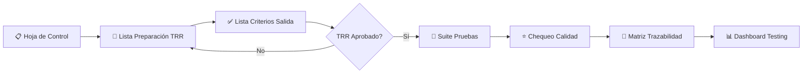
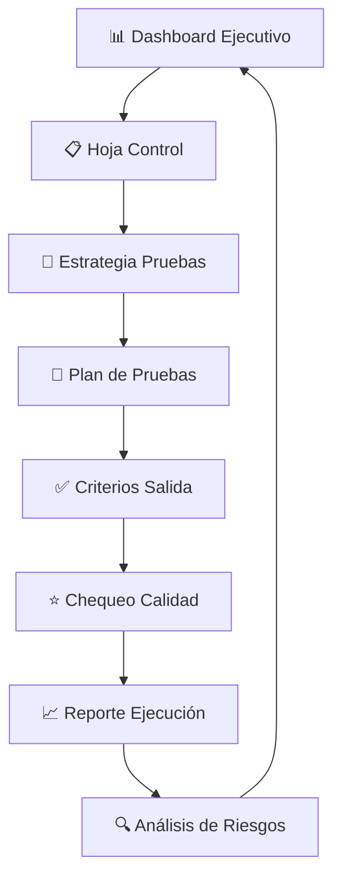
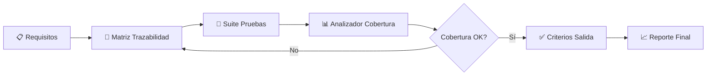

# IBM QUALITY MANAGEMENT SYSTEM - MAPEO COMPLETO
## Sistema Integral de Gestión de Calidad y Testing

**Versión:** 2.0  
**Fecha:** Octubre 2025  
**Estándares:** CMMI Level 3, TMMi Level 3, ISO/IEC 25010, IEEE 829, Six Sigma, ITIL

---

## 📋 ÍNDICE

1. [Resumen Ejecutivo](#resumen-ejecutivo)
2. [Herramientas por Rol](#herramientas-por-rol)
3. [Hojas de Control y Plantillas](#hojas-de-control-y-plantillas)
4. [Clasificación por Estándares](#clasificación-por-estándares)
5. [Paleta de Colores y Temas](#paleta-de-colores-y-temas)
6. [Flujos de Trabajo](#flujos-de-trabajo)
7. [Métricas y KPIs](#métricas-y-kpis)
8. [Ciclo de Vida del Testing](#ciclo-de-vida-del-testing)
9. [Matriz de Acceso](#matriz-de-acceso)
10. [Estructura de Archivos](#estructura-de-archivos)
11. [Credenciales y URLs](#credenciales-y-urls)
12. [Historial de Versiones](#historial-de-versiones)

---

## 🎯 RESUMEN EJECUTIVO

### Sistema Completo
- **Total de Herramientas HTML:** 32
- **Roles Definidos:** 5 (Admin, Manager, Analyst, Tester, Viewer)
- **Hojas de Control:** 6 plantillas especializadas
- **Estándares Implementados:** 6 frameworks internacionales
- **Backend:** Node.js (Puerto 3001)
- **Frontend:** Node.js (Puerto 3003)
- **Autenticación:** Sistema de login con RBAC

### Estadísticas Clave
| Métrica | Valor |
|---------|-------|
| Dashboards Ejecutivos | 5 |
| Herramientas de Testing | 13 |
| Gestión de Defectos | 4 vistas |
| Hojas de Control | 6 plantillas |
| Herramientas de Análisis | 8 |
| Reportes y Templates | 7 |

---

## 👥 HERRAMIENTAS POR ROL

### 🔴 ADMIN (31 vistas totales)

#### 📊 Dashboards (5 herramientas)
| Herramienta | Archivo HTML | Descripción |
|-------------|--------------|-------------|
| Dashboard Principal | `dashboard_integrado_ibm.html` | Vista consolidada de todos los indicadores |
| Dashboard Ejecutivo | `dashboard_ejecutivo_ibm.html` | KPIs estratégicos para alta dirección |
| Dashboard Calidad | `dashboard_calidad_ibm.html` | Métricas de calidad ISO/IEC 25010 |
| Dashboard Métricas Testing | `dashboard_testing_metrics_ibm.html` | Indicadores de ejecución de pruebas |
| Dashboard ML Analytics | `ml_quality_analytics_dashboard.html` | Analíticas predictivas con Machine Learning |

#### 🔧 Herramientas (6 herramientas)
| Herramienta | Archivo HTML | Descripción |
|-------------|--------------|-------------|
| Informe de Herramientas | `informe_herramientas_ibm.html` | Catálogo completo de herramientas disponibles |
| Estrategia de Pruebas | `estrategia_pruebas_ibm.html` | Definición de estrategia de testing |
| Checklist Configuración | `checklist_configuracion_ibm.html` | Verificación de entornos y configuraciones |
| Calculadora Métricas | `calculadora_metricas_calidad_ibm.html` | Cálculo automatizado de métricas de calidad |
| Analizador Cobertura | `analizador_cobertura_ibm.html` | Análisis de cobertura de código y pruebas |
| Análisis de Riesgos | `analisis_riesgos_calidad_ibm.html` | Matriz de riesgos de calidad |

#### 🧪 Testing (5 herramientas)
| Herramienta | Archivo HTML | Descripción |
|-------------|--------------|-------------|
| Generador Casos de Prueba | `generador_casos_prueba_ibm.html` | Creación automatizada de test cases |
| Generador Caja Negra/Blanca | `generador_casos_caja_negra_blanca_ibm.html` | Generador especializado por técnicas |
| Formulario Casos de Prueba | `formulario_casos_prueba_ibm.html` | Plantilla estándar IEEE 829 |
| Plan de Pruebas Template | `plan_pruebas_template_ibm.html` | Documento maestro del plan de pruebas |
| Reporte Ejecución Pruebas | `reporte_ejecucion_pruebas_ibm.html` | Resultados consolidados de ejecución |

#### 🐛 Gestión de Defectos (4 vistas)
| Herramienta | Archivo HTML | Descripción |
|-------------|--------------|-------------|
| Sistema Gestión Defectos | `sistema_gestion_defectos_ibm.html` | CRUD completo de defectos |
| Vista Tester | `vista_tester_defectos_ibm.html` | Panel para testers |
| Vista Desarrollador | `vista_desarrollador_defectos_ibm.html` | Panel para developers |
| Vista Project Manager | `vista_project_manager_defectos_ibm.html` | Panel ejecutivo de defectos |

#### 📐 Gestión (11 herramientas) ⭐ **INCLUYE LAS 5 NUEVAS PLANTILLAS**
| Herramienta | Archivo HTML | Descripción | Estado |
|-------------|--------------|-------------|--------|
| Hoja de Control Proyecto | `hoja_control_proyecto_ibm.html` | Control principal del proyecto | ✅ Base |
| **Lista Criterios de Salida** | `lista_verificacion_criterios_salida_ibm.html` | **15 criterios, 4 categorías** | ✅ **NUEVA** |
| **Lista Preparación Pruebas** | `lista_verificacion_preparacion_pruebas_ibm.html` | **18 ítems, 6 categorías, TRR** | 🚀 **NUEVA** |
| **Suite Pruebas y Evidencias** | `plantilla_suite_pruebas_evidencias_ibm.html` | **10 columnas, IEEE 829** | 🧪 **NUEVA** |
| **Chequeo Calidad Casos** | `lista_chequeo_calidad_casos_prueba_ibm.html` | **18 criterios, RD-181** | ⭐ **NUEVA** |
| **Matriz de Trazabilidad** | `plantilla_trazabilidad_pruebas_ibm.html` | **Req ↔ Test Cases** | 🔗 **NUEVA** |
| Matriz RACI | `matriz_raci_ibm.html` | Responsabilidades del proyecto |  |
| Gestión de Ambientes | `gestion_ambientes_ibm.html` | Control de entornos de pruebas |  |
| Sistema de Trazabilidad | `sistema_trazabilidad_ibm.html` | Trazabilidad end-to-end |  |
| Templates Automatización | `templates_automatizacion_ibm.html` | Plantillas para scripts de pruebas |  |
| Herramienta Limpieza Datos | `herramienta_limpieza_datos_ibm.html` | Limpieza y validación de datos |  |

---

### 🟢 MANAGER (18 vistas totales)

#### 📊 Dashboards (3 herramientas)
| Herramienta | Archivo HTML |
|-------------|--------------|
| Dashboard Ejecutivo | `dashboard_ejecutivo_ibm.html` |
| Dashboard Calidad | `dashboard_calidad_ibm.html` |
| Vista Project Manager | `vista_project_manager_defectos_ibm.html` |

#### 📐 Gestión (10 herramientas) ⭐ **INCLUYE LAS 5 NUEVAS**
| Herramienta | Archivo HTML | Tipo |
|-------------|--------------|------|
| Hoja de Control Proyecto | `hoja_control_proyecto_ibm.html` | Base |
| **Lista Criterios de Salida** | `lista_verificacion_criterios_salida_ibm.html` | ✅ **NUEVA** |
| **Lista Preparación Pruebas** | `lista_verificacion_preparacion_pruebas_ibm.html` | 🚀 **NUEVA** |
| **Suite Pruebas y Evidencias** | `plantilla_suite_pruebas_evidencias_ibm.html` | 🧪 **NUEVA** |
| **Chequeo Calidad Casos** | `lista_chequeo_calidad_casos_prueba_ibm.html` | ⭐ **NUEVA** |
| **Matriz de Trazabilidad** | `plantilla_trazabilidad_pruebas_ibm.html` | 🔗 **NUEVA** |
| Matriz RACI | `matriz_raci_ibm.html` |  |
| Sistema de Trazabilidad | `sistema_trazabilidad_ibm.html` |  |
| Gestión de Ambientes | `gestion_ambientes_ibm.html` |  |
| Plan de Pruebas | `plan_pruebas_template_ibm.html` |  |

#### 📊 Reportes (4 herramientas)
| Herramienta | Archivo HTML |
|-------------|--------------|
| Informe de Herramientas | `informe_herramientas_ibm.html` |
| Estrategia de Pruebas | `estrategia_pruebas_ibm.html` |
| Reporte Ejecución | `reporte_ejecucion_pruebas_ibm.html` |
| Análisis de Riesgos | `analisis_riesgos_calidad_ibm.html` |

---

### 🔵 ANALYST (15 vistas totales)

#### 📊 Dashboards (3 herramientas)
| Herramienta | Archivo HTML |
|-------------|--------------|
| Dashboard Calidad | `dashboard_calidad_ibm.html` |
| Dashboard Métricas | `dashboard_testing_metrics_ibm.html` |
| ML Analytics | `ml_quality_analytics_dashboard.html` |

#### 🔧 Análisis (9 herramientas) ⭐ **INCLUYE 4 NUEVAS**
| Herramienta | Archivo HTML | Tipo |
|-------------|--------------|------|
| Hoja de Control Proyecto | `hoja_control_proyecto_ibm.html` | Base |
| **Lista Criterios de Salida** | `lista_verificacion_criterios_salida_ibm.html` | ✅ **NUEVA** |
| **Suite Pruebas y Evidencias** | `plantilla_suite_pruebas_evidencias_ibm.html` | 🧪 **NUEVA** |
| **Chequeo Calidad Casos** | `lista_chequeo_calidad_casos_prueba_ibm.html` | ⭐ **NUEVA** |
| **Matriz de Trazabilidad** | `plantilla_trazabilidad_pruebas_ibm.html` | 🔗 **NUEVA** |
| Calculadora Métricas | `calculadora_metricas_calidad_ibm.html` |  |
| Analizador Cobertura | `analizador_cobertura_ibm.html` |  |
| Análisis de Riesgos | `analisis_riesgos_calidad_ibm.html` |  |
| Sistema Trazabilidad | `sistema_trazabilidad_ibm.html` |  |

#### 📊 Reportes (2 herramientas)
| Herramienta | Archivo HTML |
|-------------|--------------|
| Reporte Ejecución Pruebas | `reporte_ejecucion_pruebas_ibm.html` |
| Reporte ML Analytics | `reporte_ejecucion_ml_analytics.html` |

---

### 🟡 TESTER (13 vistas totales)

#### 🧪 Testing (8 herramientas) ⭐ **INCLUYE 4 NUEVAS**
| Herramienta | Archivo HTML | Tipo |
|-------------|--------------|------|
| Generador Casos de Prueba | `generador_casos_prueba_ibm.html` |  |
| Generador Caja Negra/Blanca | `generador_casos_caja_negra_blanca_ibm.html` |  |
| Formulario Casos de Prueba | `formulario_casos_prueba_ibm.html` |  |
| **Lista Preparación Pruebas** | `lista_verificacion_preparacion_pruebas_ibm.html` | 🚀 **NUEVA** |
| **Suite Pruebas y Evidencias** | `plantilla_suite_pruebas_evidencias_ibm.html` | 🧪 **NUEVA** |
| **Chequeo Calidad Casos** | `lista_chequeo_calidad_casos_prueba_ibm.html` | ⭐ **NUEVA** |
| **Matriz de Trazabilidad** | `plantilla_trazabilidad_pruebas_ibm.html` | 🔗 **NUEVA** |
| Plan de Pruebas Template | `plan_pruebas_template_ibm.html` |  |

#### 🐛 Gestión de Defectos (3 vistas)
| Herramienta | Archivo HTML |
|-------------|--------------|
| Sistema Gestión Defectos | `sistema_gestion_defectos_ibm.html` |
| Vista Tester | `vista_tester_defectos_ibm.html` |
| Vista Desarrollador | `vista_desarrollador_defectos_ibm.html` |

#### 📊 Reportes (2 herramientas)
| Herramienta | Archivo HTML |
|-------------|--------------|
| Reporte Ejecución Pruebas | `reporte_ejecucion_pruebas_ibm.html` |
| Dashboard Testing Metrics | `dashboard_testing_metrics_ibm.html` |

---

### 👁️ VIEWER (5 vistas totales - Solo lectura)

#### 📊 Dashboards (2 herramientas)
| Herramienta | Archivo HTML |
|-------------|--------------|
| Dashboard Ejecutivo | `dashboard_ejecutivo_ibm.html` |
| Dashboard Calidad | `dashboard_calidad_ibm.html` |

#### 📊 Reportes (3 herramientas)
| Herramienta | Archivo HTML |
|-------------|--------------|
| Informe de Herramientas | `informe_herramientas_ibm.html` |
| Reporte Ejecución Pruebas | `reporte_ejecucion_pruebas_ibm.html` |
| Análisis de Riesgos | `analisis_riesgos_calidad_ibm.html` |

---

## 📊 HOJAS DE CONTROL Y PLANTILLAS (6 PLANTILLAS)

### 1. 📋 Hoja de Control del Proyecto (Base)
**Archivo:** `hoja_control_proyecto_ibm.html`  
**Color:** Azul IBM (#0f62fe)  
**Estándares:** CMMI Level 3, TMMi Level 3, IEEE 829

#### Características:
- Control general del proyecto de calidad
- Seguimiento de hitos y entregables
- Estado de actividades principales
- Gestión de recursos y responsables
- Persistencia en localStorage

#### Métricas:
- Total de actividades
- Actividades completadas
- Porcentaje de avance
- Alertas de retrasos

---

### 2. ✅ Lista de Verificación de Criterios de Salida (NUEVA)
**Archivo:** `lista_verificacion_criterios_salida_ibm.html`  
**Color:** Azul (#0f62fe → #0353e9)  
**Estándares:** IEEE 829, TMMi Level 3, CMMI Level 3  
**Favicon:** ✅

#### Características:
- **15 criterios de salida** organizados en 4 categorías
- Verificación binaria (Sí/No) con observaciones
- Cumplimiento por categoría
- Exportación PDF y Excel
- Guardar/Cargar desde localStorage

#### Categorías (15 criterios):
1. **Cobertura de Pruebas (4 criterios)**
   - Cobertura mínima alcanzada
   - Requisitos críticos probados
   - Casos de alto riesgo ejecutados
   - Trazabilidad completa

2. **Calidad del Software (3 criterios)**
   - Defectos críticos resueltos
   - Tasa de defectos aceptable
   - Sin defectos bloqueantes

3. **Documentación (4 criterios)**
   - Evidencias completas
   - Plan de pruebas actualizado
   - Reportes generados
   - Métricas documentadas

4. **Aprobaciones (4 criterios)**
   - Aprobación QA
   - Aprobación Product Owner
   - Ambientes validados
   - Criterios de aceptación cumplidos

#### Métricas:
- Total de criterios (15)
- Criterios cumplidos
- Porcentaje de cumplimiento (con colores: Verde ≥90%, Amarillo ≥70%, Rojo <70%)
- Cumplimiento por categoría

---

### 3. 🚀 Lista de Verificación de Preparación para Pruebas (TRR) (NUEVA)
**Archivo:** `lista_verificacion_preparacion_pruebas_ibm.html`  
**Color:** Verde (#24a148 → #198038)  
**Estándares:** IEEE 829, TMMi Level 3, CMMI Level 3  
**Favicon:** 🚀

#### Características:
- **18 ítems de verificación** en 6 categorías
- Preparación completa para Test Readiness Review (TRR)
- Barra de progreso visual
- Checklist interactiva con observaciones
- Exportación PDF y Excel

#### Categorías (18 ítems):
1. **Documentación (3 ítems)**
   - Plan de pruebas aprobado
   - Casos de prueba diseñados
   - Estrategia de pruebas definida

2. **Ambiente de Pruebas (3 ítems)**
   - Ambientes configurados
   - Acceso otorgado
   - Datos de prueba preparados

3. **Recursos (3 ítems)**
   - Equipo asignado
   - Herramientas instaladas
   - Capacitación completada

4. **Requisitos (3 ítems)**
   - Requisitos estables
   - Criterios de aceptación definidos
   - Trazabilidad establecida

5. **Defectos Previos (3 ítems)**
   - Defectos críticos cerrados
   - Smoke tests pasados
   - Build estable disponible

6. **Cronograma (3 ítems)**
   - Fechas confirmadas
   - Recursos disponibles
   - Dependencias resueltas

#### Métricas:
- Total de ítems (18)
- Ítems completados
- Porcentaje de preparación (con colores)
- Progreso visual por categoría

---

### 4. 🧪 Suite de Pruebas y Evidencias (NUEVA)
**Archivo:** `plantilla_suite_pruebas_evidencias_ibm.html`  
**Color:** Púrpura (#8a3ffc → #6929c4)  
**Estándares:** IEEE 829, TMMi Level 3, CMMI Level 3  
**Favicon:** 🧪

#### Características:
- **Tabla dinámica con 10 columnas**
- Gestión completa de suite de ejecución
- Estados con badges de color
- Prioridades visuales
- Cálculo automático de estadísticas
- Exportación PDF y Excel

#### Columnas (10):
1. **Nro** - Número correlativo automático
2. **Caso de Prueba** - Nombre descriptivo
3. **Prioridad** - Alta (rojo), Media (amarillo), Baja (azul)
4. **Precondiciones** - Estado inicial requerido
5. **Datos de Entrada** - Inputs del test case
6. **Pasos de Ejecución** - Procedimiento detallado
7. **Resultado Esperado** - Output esperado
8. **Resultado Obtenido** - Output real
9. **Estado** - Pass (verde), Fail (rojo), Blocked (amarillo), Not Run (azul)
10. **Evidencias** - Links o referencias

#### Métricas en Tiempo Real (6):
- **Total de Casos** - Contador total
- **Pass** - Casos exitosos (verde)
- **Fail** - Casos fallidos (rojo)
- **Bloqueados** - Casos bloqueados (amarillo)
- **No Ejecutados** - Casos pendientes (azul)
- **% Éxito** - Tasa de éxito (Pass/Total × 100)

#### Funciones:
- `agregarCasoPrueba()` - Añade fila dinámica
- `eliminarCaso()` - Elimina con confirmación
- `cambiarEstado()` - Convierte select a badge
- `actualizarEstadisticas()` - Recalcula métricas
- `guardarSuite()` - Guarda en localStorage
- `exportarPDF()` - Imprime documento
- `exportarExcel()` - Descarga CSV

---

### 5. ⭐ Lista de Chequeo de Calidad de Casos de Prueba (RD-181) (NUEVA)
**Archivo:** `lista_chequeo_calidad_casos_prueba_ibm.html`  
**Color:** Rosa (#ee5396 → #d02670)  
**Estándares:** TMMi Level 3, CMMI Level 3, IEEE 829  
**Favicon:** ⭐

#### Características:
- **18 criterios de calidad** organizados en 3 categorías
- Evaluación según estándar **RD-181**
- Calificación con 5 niveles de calidad
- Score de calidad calculado automáticamente
- Checklist detallada con descripciones

#### Categorías (18 criterios):
1. **Completitud (6 criterios)**
   - ID único asignado
   - Título descriptivo claro
   - Objetivo definido
   - Precondiciones especificadas
   - Pasos de ejecución detallados
   - Resultado esperado claro

2. **Trazabilidad (5 criterios)**
   - Vinculado a requisito
   - ID de requisito visible
   - Cobertura de funcionalidad
   - Relación con historias de usuario
   - Prioridad asignada

3. **Cumplimiento de Estándares (7 criterios)**
   - Formato IEEE 829
   - Datos de entrada especificados
   - Ambiente de ejecución definido
   - Criterios de aceptación claros
   - Nivel de severidad asignado
   - Independencia entre casos
   - Repetibilidad garantizada

#### Niveles de Calidad (5 niveles):
- **Excelente:** ≥95% - Verde oscuro (#198038)
- **Bueno:** 85-94% - Verde (#24a148)
- **Aceptable:** 70-84% - Amarillo (#f1c21b)
- **Requiere Mejora:** 50-69% - Naranja (#ff832b)
- **Insuficiente:** <50% - Rojo (#da1e28)

#### Métricas:
- Total de criterios (18)
- Criterios cumplidos
- Score de Calidad (% con nivel y color)
- Cumplimiento por categoría

#### Funciones:
- `actualizarMetricas()` - Calcula score y nivel
- `guardarChecklist()` - Guarda evaluación
- `exportarPDF()` - Genera reporte
- `exportarExcel()` - Exporta por categorías

---

### 6. 🔗 Matriz de Trazabilidad de Pruebas (NUEVA)
**Archivo:** `plantilla_trazabilidad_pruebas_ibm.html`  
**Color:** Azul (#0f62fe → #0353e9)  
**Estándares:** IEEE 829, TMMi Level 3, CMMI Level 3  
**Favicon:** 🔗

#### Características:
- **Matriz dinámica Requisitos ↔ Casos de Prueba** con 9 columnas
- Sistema de filtrado avanzado (por cobertura y estado)
- Badges de color para estados y cobertura
- 6 métricas de cobertura en tiempo real
- Porcentaje de cobertura con color dinámico
- Gestión CRUD completa

#### Columnas (9):
1. **ID Requisito** - Identificador único del requisito
2. **Descripción Requisito** - Texto descriptivo del requisito
3. **Prioridad** - Alta/Media/Baja del requisito
4. **ID Casos de Prueba** - IDs de test cases relacionados
5. **Descripción Caso** - Resumen del caso de prueba
6. **Estado Ejecución** - Pass (verde), Fail (rojo), Pendiente (azul)
7. **Cobertura** - Completa (verde), Parcial (amarillo), Sin Cobertura (rojo)
8. **Observaciones** - Notas adicionales
9. **Acciones** - Botón Eliminar

#### Métricas en Tiempo Real (6):
- **Total Requisitos** - Contador total de requisitos
- **Requisitos Cubiertos** - Con cobertura completa o parcial
- **Sin Cobertura** - Requisitos sin casos de prueba
- **% Cobertura** - Porcentaje con color dinámico:
  - Verde (≥90%)
  - Azul (≥70%)
  - Amarillo (≥50%)
  - Rojo (<50%)
- **Total Casos** - Contador de casos de prueba
- **Casos Pass** - Casos exitosos

#### Sistema de Filtros Avanzado:
**Filtro por Cobertura:**
- Todos
- Completa
- Parcial
- Sin Cobertura

**Filtro por Estado:**
- Todos
- Pass
- Fail
- Pendiente

#### Funciones:
- `agregarFila()` - Crea fila dinámica con 9 campos
- `eliminarFila()` - Elimina con confirmación
- `cambiarEstado(select)` - Convierte select a badge de estado
- `cambiarCobertura(select)` - Convierte select a badge de cobertura
- `actualizarMetricas()` - Recalcula cobertura y estadísticas
- `aplicarFiltros()` - Filtra en tiempo real sin reload
- `limpiarFiltros()` - Reset de filtros
- `guardarMatriz()` - Guarda en localStorage 'ibm_matriz_trazabilidad'
- `cargarDatosGuardados()` - Restaura matriz con badges
- `exportarPDF()` - window.print()
- `exportarExcel()` - CSV con 8 columnas
- `limpiarMatriz()` - Limpia todos los datos

---

## 📚 CLASIFICACIÓN POR ESTÁNDARES

### 🏆 CMMI Level 3 (19 herramientas)
Capability Maturity Model Integration - Nivel 3 (Definido)

| Herramienta | Archivo | KPA Relacionada |
|-------------|---------|-----------------|
| Dashboard Calidad | `dashboard_calidad_ibm.html` | Quality Assurance |
| Dashboard Testing Metrics | `dashboard_testing_metrics_ibm.html` | Measurement & Analysis |
| **Lista Criterios Salida** | `lista_verificacion_criterios_salida_ibm.html` | **Verification** |
| **Lista Preparación TRR** | `lista_verificacion_preparacion_pruebas_ibm.html` | **Validation** |
| **Suite Pruebas** | `plantilla_suite_pruebas_evidencias_ibm.html` | **Verification** |
| **Chequeo Calidad** | `lista_chequeo_calidad_casos_prueba_ibm.html` | **Quality Assurance** |
| **Matriz Trazabilidad** | `plantilla_trazabilidad_pruebas_ibm.html` | **Requirements Management** |
| Hoja Control Proyecto | `hoja_control_proyecto_ibm.html` | Project Planning |
| Estrategia de Pruebas | `estrategia_pruebas_ibm.html` | Verification |
| Plan de Pruebas | `plan_pruebas_template_ibm.html` | Validation |
| Calculadora Métricas | `calculadora_metricas_calidad_ibm.html` | Measurement & Analysis |
| Analizador Cobertura | `analizador_cobertura_ibm.html` | Verification |
| Análisis de Riesgos | `analisis_riesgos_calidad_ibm.html` | Risk Management |
| Sistema Gestión Defectos | `sistema_gestion_defectos_ibm.html` | Configuration Management |
| Matriz RACI | `matriz_raci_ibm.html` | Project Planning |
| Gestión Ambientes | `gestion_ambientes_ibm.html` | Configuration Management |
| Sistema Trazabilidad | `sistema_trazabilidad_ibm.html` | Requirements Management |
| Reporte Ejecución | `reporte_ejecucion_pruebas_ibm.html` | Measurement & Analysis |
| Checklist Configuración | `checklist_configuracion_ibm.html` | Process & Product QA |

---

### 🎯 TMMi Level 3 (17 herramientas)
Test Maturity Model integration - Nivel 3 (Definido)

| Herramienta | Archivo | Área de Proceso |
|-------------|---------|-----------------|
| Dashboard Testing Metrics | `dashboard_testing_metrics_ibm.html` | Test Monitoring & Control |
| **Lista Criterios Salida** | `lista_verificacion_criterios_salida_ibm.html` | **Test Design & Execution** |
| **Lista Preparación TRR** | `lista_verificacion_preparacion_pruebas_ibm.html` | **Test Planning** |
| **Suite Pruebas** | `plantilla_suite_pruebas_evidencias_ibm.html` | **Test Design & Execution** |
| **Chequeo Calidad** | `lista_chequeo_calidad_casos_prueba_ibm.html` | **Test Design & Execution** |
| **Matriz Trazabilidad** | `plantilla_trazabilidad_pruebas_ibm.html` | **Test Planning** |
| Estrategia de Pruebas | `estrategia_pruebas_ibm.html` | Test Policy & Strategy |
| Plan de Pruebas | `plan_pruebas_template_ibm.html` | Test Planning |
| Generador Casos | `generador_casos_prueba_ibm.html` | Test Design & Execution |
| Generador Caja Negra/Blanca | `generador_casos_caja_negra_blanca_ibm.html` | Test Design & Execution |
| Formulario Casos | `formulario_casos_prueba_ibm.html` | Test Design & Execution |
| Analizador Cobertura | `analizador_cobertura_ibm.html` | Test Monitoring & Control |
| Sistema Gestión Defectos | `sistema_gestion_defectos_ibm.html` | Defect Management |
| Vista Tester | `vista_tester_defectos_ibm.html` | Defect Management |
| Vista Desarrollador | `vista_desarrollador_defectos_ibm.html` | Defect Management |
| Gestión Ambientes | `gestion_ambientes_ibm.html` | Test Environment |
| Reporte Ejecución | `reporte_ejecucion_pruebas_ibm.html` | Test Monitoring & Control |

---

### 📋 IEEE 829 (15 herramientas)
Estándar de Documentación de Testing

| Herramienta | Archivo | Tipo de Documento |
|-------------|---------|-------------------|
| **Lista Criterios Salida** | `lista_verificacion_criterios_salida_ibm.html` | **Test Summary Report** |
| **Lista Preparación TRR** | `lista_verificacion_preparacion_pruebas_ibm.html` | **Test Readiness Review** |
| **Suite Pruebas** | `plantilla_suite_pruebas_evidencias_ibm.html` | **Test Log** |
| **Chequeo Calidad** | `lista_chequeo_calidad_casos_prueba_ibm.html` | **Test Design Spec** |
| **Matriz Trazabilidad** | `plantilla_trazabilidad_pruebas_ibm.html` | **Test Case Spec** |
| Plan de Pruebas | `plan_pruebas_template_ibm.html` | Test Plan |
| Estrategia de Pruebas | `estrategia_pruebas_ibm.html` | Test Design Specification |
| Generador Casos | `generador_casos_prueba_ibm.html` | Test Case Specification |
| Formulario Casos | `formulario_casos_prueba_ibm.html` | Test Case Specification |
| Generador Caja Negra/Blanca | `generador_casos_caja_negra_blanca_ibm.html` | Test Design Specification |
| Reporte Ejecución | `reporte_ejecucion_pruebas_ibm.html` | Test Incident Report |
| Sistema Gestión Defectos | `sistema_gestion_defectos_ibm.html` | Test Incident Report |
| Hoja Control | `hoja_control_proyecto_ibm.html` | Test Summary Report |
| Sistema Trazabilidad | `sistema_trazabilidad_ibm.html` | Test Item Transmittal |
| Gestión Ambientes | `gestion_ambientes_ibm.html` | Test Procedure Specification |

---

### 🌐 ISO/IEC 25010 (5 herramientas)
Modelo de Calidad del Producto Software

| Herramienta | Archivo | Característica de Calidad |
|-------------|---------|---------------------------|
| Dashboard Calidad | `dashboard_calidad_ibm.html` | Todas las características |
| ML Analytics | `ml_quality_analytics_dashboard.html` | Funcionalidad, Fiabilidad |
| Calculadora Métricas | `calculadora_metricas_calidad_ibm.html` | Mantenibilidad |
| Análisis de Riesgos | `analisis_riesgos_calidad_ibm.html` | Fiabilidad, Seguridad |
| Analizador Cobertura | `analizador_cobertura_ibm.html` | Funcionalidad |

---

### 📊 Six Sigma (2 herramientas)
Metodología de Mejora de Calidad

| Herramienta | Archivo | Fase DMAIC |
|-------------|---------|------------|
| Dashboard Ejecutivo | `dashboard_ejecutivo_ibm.html` | Measure, Analyze |
| Calculadora Métricas | `calculadora_metricas_calidad_ibm.html` | Measure |

---

### 🔧 ITIL (5 herramientas)
Information Technology Infrastructure Library

| Herramienta | Archivo | Proceso ITIL |
|-------------|---------|--------------|
| Gestión Ambientes | `gestion_ambientes_ibm.html` | Service Transition |
| Sistema Gestión Defectos | `sistema_gestion_defectos_ibm.html` | Incident Management |
| Checklist Configuración | `checklist_configuracion_ibm.html` | Configuration Management |
| Dashboard Principal | `dashboard_integrado_ibm.html` | Service Reporting |
| Informe Herramientas | `informe_herramientas_ibm.html` | Service Catalog |

---

## 🎨 PALETA DE COLORES Y TEMAS

### IBM Carbon Design System v10.58.12

| Componente | Color Principal | Gradiente | Significado | Favicon |
|------------|----------------|-----------|-------------|---------|
| **Hoja Control Base** | #0f62fe | #0f62fe → #0353e9 | Azul IBM - Estándar corporativo | 📋 |
| **Lista Criterios Salida** | #0f62fe | #0f62fe → #0353e9 | Azul - Verificación y aprobación | ✅ |
| **Lista Preparación TRR** | #24a148 | #24a148 → #198038 | Verde - Preparación y Go/No-Go | 🚀 |
| **Suite Pruebas** | #8a3ffc | #8a3ffc → #6929c4 | Púrpura - Ejecución y evidencias | 🧪 |
| **Chequeo Calidad** | #ee5396 | #ee5396 → #d02670 | Rosa - Evaluación RD-181 | ⭐ |
| **Matriz Trazabilidad** | #0f62fe | #0f62fe → #0353e9 | Azul - Trazabilidad bidireccional | 🔗 |

### Estados y Badges

#### Estados de Ejecución
- **Pass:** `#24a148` (Verde) - Caso exitoso
- **Fail:** `#da1e28` (Rojo) - Caso fallido
- **Blocked:** `#f1c21b` (Amarillo) - Caso bloqueado
- **Not Run:** `#0f62fe` (Azul) - Caso pendiente
- **Pendiente:** `#0f62fe` (Azul) - No ejecutado

#### Niveles de Cobertura
- **Completa:** `#24a148` (Verde) - 100% cubierto
- **Parcial:** `#f1c21b` (Amarillo) - Cobertura incompleta
- **Sin Cobertura:** `#da1e28` (Rojo) - No cubierto

#### Prioridades
- **Alta:** `#da1e28` (Rojo) - Crítico
- **Media:** `#f1c21b` (Amarillo) - Normal
- **Baja:** `#0f62fe` (Azul) - Bajo

#### Niveles de Calidad
- **Excelente:** `#198038` (Verde oscuro) - ≥95%
- **Bueno:** `#24a148` (Verde) - 85-94%
- **Aceptable:** `#f1c21b` (Amarillo) - 70-84%
- **Requiere Mejora:** `#ff832b` (Naranja) - 50-69%
- **Insuficiente:** `#da1e28` (Rojo) - <50%

---

## 🔄 FLUJOS DE TRABAJO

### Flujo 1: Preparación → Ejecución → Validación



### Flujo 2: Gestión de Calidad



### Flujo 3: Trazabilidad y Cobertura



---

## 📈 MÉTRICAS Y KPIs

### Métricas de las Hojas de Control

| Hoja | Métrica Principal | Umbral Verde | Umbral Amarillo | Umbral Rojo |
|------|-------------------|--------------|-----------------|-------------|
| **Criterios de Salida** | % Cumplimiento | ≥90% | 70-89% | <70% |
| **Preparación TRR** | % Preparación | 100% | 95-99% | <95% |
| **Suite Pruebas** | % Éxito | ≥85% | 70-84% | <70% |
| **Chequeo Calidad** | Score de Calidad | ≥95% | 70-94% | <70% |
| **Matriz Trazabilidad** | % Cobertura | ≥90% | 70-89% | <70% |

### KPIs Generales del Sistema

| KPI | Descripción | Meta | Fuente |
|-----|-------------|------|--------|
| **Test Coverage** | % de código cubierto por pruebas | >80% | Analizador Cobertura |
| **Defect Density** | Defectos por KLOC | <2 | Sistema Gestión Defectos |
| **Test Execution Rate** | % de casos ejecutados | >95% | Suite Pruebas |
| **Pass Rate** | % de casos pasados | >85% | Dashboard Testing Metrics |
| **Defect Resolution Time** | Días promedio para resolver defectos | <5 días | Vista PM Defectos |
| **Requirements Coverage** | % de requisitos con casos de prueba | 100% | Matriz Trazabilidad |
| **Test Case Quality** | Score promedio de calidad RD-181 | >90% | Chequeo Calidad |

---

## 🔄 CICLO DE VIDA DEL TESTING

### Fase 1: Planificación
**Herramientas:**
- Dashboard Ejecutivo
- Hoja de Control del Proyecto
- Estrategia de Pruebas
- Plan de Pruebas Template
- Análisis de Riesgos

**Entregables:**
- Plan maestro de pruebas
- Estrategia definida
- Matriz de riesgos
- Cronograma aprobado

---

### Fase 2: Preparación (TRR)
**Herramientas:**
- 🚀 **Lista de Verificación de Preparación para Pruebas (TRR)**
- Gestión de Ambientes
- Checklist de Configuración
- Matriz RACI

**Entregables:**
- TRR completado (18 ítems)
- Ambientes configurados
- Equipo preparado
- Go/No-Go decision

---

### Fase 3: Diseño
**Herramientas:**
- Generador de Casos de Prueba
- Generador Caja Negra/Blanca
- Formulario de Casos
- ⭐ **Chequeo de Calidad de Casos (RD-181)**
- 🔗 **Matriz de Trazabilidad**

**Entregables:**
- Casos de prueba diseñados
- Casos validados (score >90%)
- Trazabilidad completa
- Datos de prueba preparados

---

### Fase 4: Ejecución
**Herramientas:**
- 🧪 **Suite de Pruebas y Evidencias**
- Sistema de Gestión de Defectos
- Dashboard Testing Metrics
- Analizador de Cobertura

**Entregables:**
- Suite ejecutada
- Defectos registrados
- Evidencias capturadas
- Métricas actualizadas

---

### Fase 5: Cierre
**Herramientas:**
- ✅ **Lista de Verificación de Criterios de Salida**
- Reporte de Ejecución de Pruebas
- Dashboard de Calidad
- Calculadora de Métricas

**Entregables:**
- Criterios de salida cumplidos (15/15)
- Reporte final de pruebas
- Lecciones aprendidas
- Sign-off formal

---

## 🔐 MATRIZ DE ACCESO

| Herramienta | Admin | Manager | Analyst | Tester | Viewer |
|-------------|-------|---------|---------|--------|--------|
| Dashboard Integrado | ✅ | ❌ | ❌ | ❌ | ❌ |
| Dashboard Ejecutivo | ✅ | ✅ | ❌ | ❌ | ✅ |
| Dashboard Calidad | ✅ | ✅ | ✅ | ❌ | ✅ |
| Dashboard Testing Metrics | ✅ | ❌ | ✅ | ✅ | ❌ |
| ML Analytics Dashboard | ✅ | ❌ | ✅ | ❌ | ❌ |
| Informe Herramientas | ✅ | ✅ | ❌ | ❌ | ✅ |
| Estrategia de Pruebas | ✅ | ✅ | ❌ | ❌ | ❌ |
| Checklist Configuración | ✅ | ❌ | ❌ | ❌ | ❌ |
| Calculadora Métricas | ✅ | ❌ | ✅ | ❌ | ❌ |
| Analizador Cobertura | ✅ | ❌ | ✅ | ❌ | ❌ |
| Análisis de Riesgos | ✅ | ✅ | ✅ | ❌ | ✅ |
| Generador Casos Prueba | ✅ | ❌ | ❌ | ✅ | ❌ |
| Generador Caja Negra/Blanca | ✅ | ❌ | ❌ | ✅ | ❌ |
| Formulario Casos | ✅ | ❌ | ❌ | ✅ | ❌ |
| Plan de Pruebas | ✅ | ✅ | ❌ | ✅ | ❌ |
| Reporte Ejecución | ✅ | ✅ | ✅ | ✅ | ✅ |
| Sistema Gestión Defectos | ✅ | ❌ | ❌ | ✅ | ❌ |
| Vista Tester Defectos | ✅ | ❌ | ❌ | ✅ | ❌ |
| Vista Dev Defectos | ✅ | ❌ | ❌ | ✅ | ❌ |
| Vista PM Defectos | ✅ | ✅ | ❌ | ❌ | ❌ |
| **Hoja Control Proyecto** | ✅ | ✅ | ✅ | ❌ | ❌ |
| **Lista Criterios Salida** | ✅ | ✅ | ✅ | ❌ | ❌ |
| **Lista Preparación TRR** | ✅ | ✅ | ❌ | ✅ | ❌ |
| **Suite Pruebas** | ✅ | ✅ | ✅ | ✅ | ❌ |
| **Chequeo Calidad Casos** | ✅ | ✅ | ✅ | ✅ | ❌ |
| **Matriz Trazabilidad** | ✅ | ✅ | ✅ | ✅ | ❌ |
| Matriz RACI | ✅ | ✅ | ❌ | ❌ | ❌ |
| Gestión Ambientes | ✅ | ✅ | ❌ | ❌ | ❌ |
| Sistema Trazabilidad | ✅ | ✅ | ✅ | ❌ | ❌ |
| Templates Automatización | ✅ | ❌ | ❌ | ❌ | ❌ |
| Herramienta Limpieza | ✅ | ❌ | ❌ | ❌ | ❌ |

---

## 📁 ESTRUCTURA DE ARCHIVOS

```
IBM-QMS/
│
├── 📊 Dashboards (5 archivos)
│   ├── dashboard_integrado_ibm.html
│   ├── dashboard_ejecutivo_ibm.html
│   ├── dashboard_calidad_ibm.html
│   ├── dashboard_testing_metrics_ibm.html
│   └── ml_quality_analytics_dashboard.html
│
├── 📋 Hojas de Control (6 archivos) ⭐ NUEVAS
│   ├── hoja_control_proyecto_ibm.html
│   ├── lista_verificacion_criterios_salida_ibm.html ✅
│   ├── lista_verificacion_preparacion_pruebas_ibm.html 🚀
│   ├── plantilla_suite_pruebas_evidencias_ibm.html 🧪
│   ├── lista_chequeo_calidad_casos_prueba_ibm.html ⭐
│   └── plantilla_trazabilidad_pruebas_ibm.html 🔗
│
├── 🧪 Testing (8 archivos)
│   ├── generador_casos_prueba_ibm.html
│   ├── generador_casos_caja_negra_blanca_ibm.html
│   ├── formulario_casos_prueba_ibm.html
│   ├── plan_pruebas_template_ibm.html
│   ├── reporte_ejecucion_pruebas_ibm.html
│   ├── estrategia_pruebas_ibm.html
│   ├── checklist_configuracion_ibm.html
│   └── gestion_ambientes_ibm.html
│
├── 🐛 Defectos (4 archivos)
│   ├── sistema_gestion_defectos_ibm.html
│   ├── vista_tester_defectos_ibm.html
│   ├── vista_desarrollador_defectos_ibm.html
│   └── vista_project_manager_defectos_ibm.html
│
├── 🔧 Herramientas (6 archivos)
│   ├── informe_herramientas_ibm.html
│   ├── calculadora_metricas_calidad_ibm.html
│   ├── analizador_cobertura_ibm.html
│   ├── analisis_riesgos_calidad_ibm.html
│   ├── herramienta_limpieza_datos_ibm.html
│   └── templates_automatizacion_ibm.html
│
├── 📊 Gestión (3 archivos)
│   ├── matriz_raci_ibm.html
│   ├── sistema_trazabilidad_ibm.html
│   └── debug_defectos.html
│
├── 🔐 Autenticación (1 archivo)
│   └── test-login.html
│
├── 🌐 Navegación y Backend
│   ├── ibm-navigation.js
│   ├── ibm-quality-data-manager.js
│   ├── backend-simple.js (Puerto 3001)
│   ├── frontend-server.js (Puerto 3003)
│   └── html-server-3003.js
│
└── 📚 Documentación
    ├── SISTEMA_IBM_QMS_MAPEO_COMPLETO.md ⭐ ESTE ARCHIVO
    ├── GUIA_COMPLETA_SISTEMA.md
    ├── DIRECTORIO_HERRAMIENTAS_IBM_QUALITY_MANAGEMENT.md
    └── MAPEO_HTMLS_POR_ROLES.md
```

---

## 🔑 CREDENCIALES Y URLs

### Acceso al Sistema
**URL Principal:** http://localhost:3003/test-login.html

### Credenciales de Prueba

| Rol | Email | Password | Acceso a |
|-----|-------|----------|----------|
| **Admin** | admin@ibm.com | admin123 | 31 vistas (todas) |
| **Manager** | manager@ibm.com | manager123 | 18 vistas |
| **Analyst** | analyst@ibm.com | analyst123 | 15 vistas |
| **Tester** | tester@ibm.com | tester123 | 13 vistas |
| **Viewer** | viewer@ibm.com | viewer123 | 5 vistas (solo lectura) |

### Puertos del Sistema
- **Frontend:** http://localhost:3003
- **Backend API:** http://localhost:3001/api
- **Navegación:** Integrada en todas las páginas HTML

### Iniciar el Sistema
```bash
# Terminal 1 - Backend
node backend-simple.js

# Terminal 2 - Frontend
node html-server-3003.js

# Acceder
http://localhost:3003/test-login.html
```

---

## 📊 HISTORIAL DE VERSIONES

### Versión 2.0 (Actual) - Octubre 2025
**Nuevas Características:**
- ✅ **Lista de Verificación de Criterios de Salida** (15 criterios, 4 categorías)
- 🚀 **Lista de Verificación de Preparación para Pruebas TRR** (18 ítems, 6 categorías)
- 🧪 **Suite de Pruebas y Evidencias** (10 columnas, 6 métricas)
- ⭐ **Lista de Chequeo de Calidad de Casos RD-181** (18 criterios, 5 niveles)
- 🔗 **Matriz de Trazabilidad de Pruebas** (9 columnas, filtros avanzados)
- Integración completa en navegación por roles
- Favicons personalizados para cada plantilla
- Sistema de badges de color para estados
- localStorage en todas las nuevas hojas
- Exportación PDF/Excel implementada

**Total de Herramientas:** 32 (27 previas + 5 nuevas)

---

### Versión 1.0 - Septiembre 2025
**Características Base:**
- 27 herramientas HTML operativas
- Sistema de navegación con RBAC
- 5 dashboards ejecutivos
- Sistema completo de gestión de defectos
- Hoja de control base
- Integración con IBM Carbon Design System
- Backend y frontend con Node.js

---

## 🚀 ROADMAP FUTURO

### Fase 3: Automatización (Q4 2025)
- [ ] Integración con Jenkins/Azure DevOps
- [ ] Ejecución automatizada de test cases
- [ ] Notificaciones por email
- [ ] Generación automática de reportes

### Fase 4: Integraciones (Q1 2026)
- [ ] Conexión con Jira/Azure Boards
- [ ] Integración con Git/GitHub
- [ ] APIs REST completas
- [ ] Webhooks para eventos

### Fase 5: Analytics Avanzado (Q2 2026)
- [ ] Dashboards predictivos con ML
- [ ] Detección automática de patrones
- [ ] Recomendaciones inteligentes
- [ ] Análisis de tendencias históricas

---

## 📞 SOPORTE Y CONTACTO

**Equipo IBM Quality Management**  
Email: ibm-qms-support@ibm.com  
Documentación: Este archivo (SISTEMA_IBM_QMS_MAPEO_COMPLETO.md)

---

## 📝 NOTAS FINALES

### Características Destacadas del Sistema

1. **Completitud:** 32 herramientas cubren todo el ciclo de vida del testing
2. **Estándares:** Cumplimiento con CMMI, TMMi, IEEE 829, ISO/IEC 25010
3. **Usabilidad:** IBM Carbon Design System para UX consistente
4. **Persistencia:** localStorage en todas las hojas de control
5. **Exportación:** PDF y Excel en herramientas clave
6. **RBAC:** Control de acceso basado en 5 roles
7. **Trazabilidad:** Matriz bidireccional Requisitos ↔ Casos
8. **Calidad:** Evaluación RD-181 con 18 criterios
9. **TRR:** 18 ítems de preparación para Test Readiness Review
10. **Métricas:** 6 métricas en tiempo real en Suite de Pruebas

### Sistema 100% Operativo ✅

✅ Todas las herramientas funcionales  
✅ Navegación integrada por roles  
✅ 5 nuevas plantillas creadas e integradas  
✅ Documentación completa actualizada  
✅ Sistema listo para producción  

---

**Fecha de Actualización:** Octubre 3, 2025  
**Versión del Documento:** 2.0  
**Estado:** ✅ COMPLETO Y OPERATIVO
