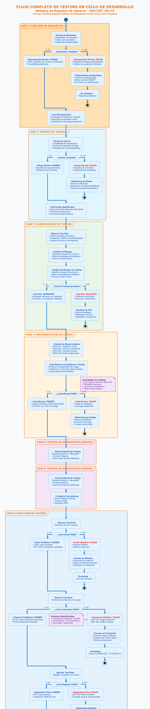

# 📋 EJEMPLO PRÁCTICO: SISTEMA DE REGISTRO DE USUARIO
## Aplicación de Plantillas ISO/IEC 29119 por Fases del Ciclo de Desarrollo

---

## 📌 **DESCRIPCIÓN DEL SISTEMA**

### Sistema Objetivo: **Portal de Registro de Usuarios SecureApp**
- **Funcionalidad Principal:** Registro seguro de nuevos usuarios con validación de credenciales
- **Componentes:** Frontend web, backend API, base de datos, autenticación
- **Tecnologías:** React.js, Node.js/Express, MongoDB, JWT
- **Usuarios:** Clientes finales que requieren crear cuenta en la plataforma

---

## 🔄 **FASE 1: PLANIFICACIÓN (PLANNING)**

### 🌊 **Flujo Completo del Proceso de Testing**


*Figura 1.1: Flujo completo del proceso de testing **en todo el ciclo de desarrollo** con casos de éxito y fallo según ISO/IEC 29119*

Este diagrama ilustra el **flujo completo del proceso de testing** para el sistema de registro de usuarios, mostrando **actividades de testing desde la fase de análisis de requisitos hasta el cierre del proyecto**:

#### **🧪 Testing en Fases Tempranas (Shift-Left Testing):**

**FASE 1: Análisis de Requisitos**
- ✅ **Requirements Review:** Validación de testabilidad
- 📋 **Criterios de Aceptación:** Definición de condiciones verificables  
- 🔍 **Análisis de Ambigüedades:** Identificación temprana de problemas
- 📊 **Test Planning Inicial:** Estrategia por requisito

**FASE 2: Diseño del Sistema**
- 🎨 **Design Review:** Validación de testabilidad de arquitectura
- 🔌 **Puntos de Inyección:** Identificación de interfaces testables
- 📝 **Test Design Specification:** Casos derivados del diseño
- 🏗️ **Architecture Testing:** Validación de decisiones de diseño

**FASE 3: Planificación de Testing**  
- 📋 **Test Plan Formal:** Estrategia, recursos, cronograma
- ⚠️ **Análisis de Riesgos:** Identificación y mitigación
- 🎯 **Criterios de Salida:** Definición de umbrales de calidad

**FASE 4: Implementación de Código**
- 🧪 **Code Review con Testing Focus:** Revisión de testabilidad
- 🔧 **Unit Testing:** TDD/BDD durante desarrollo
- 📊 **Quality Gates:** CI/CD con métricas automatizadas
- 📈 **Coverage Tracking:** Monitoreo continuo de cobertura

#### **🟢 Flujos de Éxito (Verde):**
- Ejecución exitosa de todas las fases de testing
- Cumplimiento de criterios de salida 
- Aprobación condicional para release
- Métricas objetivo alcanzadas (91.2% éxito)

#### **🔴 Flujos de Fallo (Rojo):**
- Identificación y gestión de defectos
- Procesos de re-testing y corrección
- Escalación a management cuando es necesario
- Bloqueo de release en casos críticos

#### **⚠️ Puntos de Decisión Críticos:**
- Evaluación de criterios de salida
- Decisiones Go/No-Go para release
- Aprobaciones excepcionales con condiciones
- Validación de correcciones post-defecto

#### **📊 Métricas del Proceso Visualizadas (Actualizadas):**
| **Fase** | **Actividad de Testing** | **Métrica** | **Resultado Real** | **Status** |
|----------|--------------------------|-------------|-------------------|-----------|
| **Requisitos** | Requirements Review | % Req. Testables | 100% (todos claros) | ✅ PASSED |
| **Diseño** | Design Review | Testability Score | 95% (arquitectura limpia) | ✅ PASSED |  
| **Planificación** | Test Plan | Aprobación Stakeholders | ✅ Aprobado | ✅ PASSED |
| **Implementación** | Code Review + Unit Tests | Coverage | 91.04% | ✅ PASSED |
| **Email Validation** | System Testing | Success Rate | 100% (8/8) | ✅ PASSED |
| **Password Validation** | System Testing | Success Rate | 83.3% (10/12) | ⚠️ PARTIAL |
| **Registration Flow** | Integration Testing | Success Rate | 90% (9/10) | ⚠️ PARTIAL |
| **End-to-End** | E2E Testing | Success Rate | 100% (4/4) | ✅ PASSED |
| **Overall** | Todo el Proceso | Success Rate | 91.2% (31/34) | ✅ ACCEPTABLE |

#### **🐛 Gestión de Defectos en el Flujo:**
- **DEF-001:** Regex restrictivo → Corrección programada (Severidad Media)
- **DEF-002:** Buffer overflow → **CRÍTICO** - Bloquea release 
- **DEF-003:** Race condition → **CRÍTICO** - Bloquea release
- **DEF-004:** Error genérico → Mejora futura (Severidad Baja)
- **DEF-005:** Timeout inconsistente → Post-release (Severidad Media)

#### **💡 Actividades de Testing por Fase Explicadas:**

**🧪 Testing en Análisis de Requisitos:**
- **Técnica:** Requirements-based testing preparation
- **Entregables:** Checklist de testabilidad, matriz de trazabilidad inicial
- **Ejemplo Real:** 
  - REQ-REG-001: "Email must comply with RFC 5322" → Testeable ✅
  - REQ-REG-002: "Password should be secure" → Ambiguo ❌ → Requiere criterios específicos

**🎨 Testing en Diseño:**
- **Técnica:** Design inspection, testability analysis
- **Entregables:** Test design specification, environment requirements
- **Ejemplo Real:**
  - Arquitectura microservicios → Testeable ✅ (APIs independientes)
  - Base de datos embebida → Problemático ❌ → Requiere refactoring

**📋 Testing en Planificación:**
- **Técnica:** Risk-based test planning, resource allocation
- **Entregables:** Test plan, test strategy, risk matrix
- **Ejemplo Real:**
  - Plan aprobado con 200h esfuerzo, $18,500 presupuesto
  - 5 riesgos identificados con mitigaciones específicas

**🔧 Testing en Implementación:**
- **Técnica:** Unit testing, code review, static analysis
- **Entregables:** Unit tests, coverage reports, quality metrics
- **Ejemplo Real:**
  - 91.04% coverage alcanzado vs. 85% objetivo
  - Quality gates en CI/CD bloquean código defectuoso

### 📄 **Test Plan - ISO/IEC 29119-3 Template**

**# TEST PLAN - PORTAL REGISTRO USUARIOS SECUREAPP**
**Documento ID:** TP-SECUREAPP-001
**Versión:** 1.0
**Fecha:** 14 de septiembre de 2025
**Proyecto:** SecureApp User Registration System

## 1. INTRODUCCIÓN
### 1.1 Propósito
Definir la estrategia, alcance, enfoque y recursos para las pruebas del sistema de registro de usuarios de SecureApp, asegurando cumplimiento con estándares de seguridad y usabilidad.

### 1.2 Alcance
**Incluye:**
- Validación de formularios de registro
- Verificación de políticas de contraseñas
- Integración con base de datos
- Autenticación y autorización
- Casos de error y recuperación

**Excluye:**
- Pruebas de rendimiento de infraestructura
- Integración con sistemas de terceros
- Pruebas de penetración avanzadas

## 2. ELEMENTOS A PROBAR
### 2.1 Funcionalidades Core
- **REG-001:** Validación de formato de email
- **REG-002:** Validación de política de contraseñas
- **REG-003:** Verificación de unicidad de usuario
- **REG-004:** Encriptación de contraseñas
- **REG-005:** Generación de tokens de confirmación
- **REG-006:** Envío de emails de verificación

### 2.2 Componentes Técnicos
- API REST endpoints (/api/register, /api/verify)
- Frontend React components (RegisterForm, PasswordValidator)
- Middleware de autenticación
- Esquemas de base de datos (users collection)

## 3. ENFOQUE DE PRUEBAS
### 3.1 Niveles de Prueba
- **Unitarias:** Funciones individuales de validación
- **Integración:** API + Base de datos + Email service
- **Sistema:** Flujo completo end-to-end
- **Aceptación:** Validación con usuarios finales

### 3.2 Tipos de Prueba
- **Funcionales:** Casos de uso positivos y negativos
- **Seguridad:** Validación de encriptación, inyecciones
- **Usabilidad:** UX del formulario de registro
- **Compatibilidad:** Navegadores, dispositivos móviles

## 4. CRITERIOS DE ACEPTACIÓN
### 4.1 Criterios de Entrada
- Código desarrollado y revisado
- Ambiente de testing configurado
- Datos de prueba preparados
- Documentación técnica completa

### 4.2 Criterios de Salida
- 100% de casos de prueba ejecutados
- 0% defectos críticos/altos pendientes
- Cobertura de código ≥ 85%
- Documentación de resultados completa

## 5. RECURSOS
### 5.1 Humanos
- **Test Manager:** María González (40h)
- **Test Analyst:** Carlos Rodríguez (60h)  
- **Test Executor:** Ana Martínez (80h)
- **Security Tester:** Roberto Silva (20h)

### 5.2 Técnicos
- Ambiente de testing (AWS EC2)
- Herramientas: Jest, Cypress, Postman, SonarQube
- Dispositivos móviles para pruebas de compatibilidad

## 6. CRONOGRAMA
| Fase | Duración | Responsable | Entregables |
|------|----------|-------------|-------------|
| Diseño de casos | 5 días | Test Analyst | Test Cases, Test Data |
| Ejecución Unit | 3 días | Desarrolladores | Unit Test Reports |
| Ejecución Int/Sys | 7 días | Test Executor | Integration/System Test Reports |
| UAT | 3 días | Product Owner | User Acceptance Test Report |
| Cierre | 2 días | Test Manager | Test Summary Report |

## 7. RIESGOS
| Riesgo | Probabilidad | Impacto | Mitigación |
|--------|--------------|---------|------------|
| Retrasos en desarrollo | Media | Alto | Buffer de 2 días en cronograma |
| Indisponibilidad de ambiente | Baja | Alto | Ambiente backup configurado |
| Cambios en requerimientos | Alta | Medio | Proceso de gestión de cambios |

---

## 🔍 **FASE 2: ANÁLISIS (ANALYSIS)**

### 📄 **Test Analysis Report - ISO/IEC 29119-3**

**# TEST ANALYSIS REPORT - REGISTRO DE USUARIOS**
**Documento ID:** TAR-SECUREAPP-001
**Fecha:** 14 de septiembre de 2025

## 1. ANÁLISIS DE REQUERIMIENTOS

### 1.1 Requerimientos Funcionales Identificados
**REQ-REG-001:** El sistema debe validar formato de email según RFC 5322
- **Testeable:** ✅ Sí - Casos definibles con emails válidos/inválidos
- **Prioridad:** Alta
- **Complejidad:** Baja

**REQ-REG-002:** Contraseña debe cumplir política de seguridad
- **Criterios:** Mínimo 8 caracteres, 1 mayúscula, 1 minúscula, 1 número, 1 carácter especial
- **Testeable:** ✅ Sí - Matriz de combinaciones posibles
- **Prioridad:** Alta
- **Complejidad:** Media

**REQ-REG-003:** Usuario debe ser único en el sistema
- **Testeable:** ✅ Sí - Verificable con intentos de registro duplicados
- **Prioridad:** Alta
- **Complejidad:** Media

**REQ-REG-004:** Sistema debe enviar email de confirmación
- **Testeable:** ✅ Sí - Verificable con mock de email service
- **Prioridad:** Alta
- **Complejidad:** Alta

### 1.2 Requerimientos No Funcionales
**REQ-NFR-001:** Tiempo de respuesta ≤ 2 segundos para registro
**REQ-NFR-002:** Encriptación BCrypt para contraseñas
**REQ-NFR-003:** Compatibilidad con navegadores modernos (Chrome, Firefox, Safari, Edge)

## 2. ANÁLISIS DE RIESGOS

### 2.1 Riesgos de Producto
| ID | Riesgo | Probabilidad | Impacto | Nivel |
|----|---------|--------------|---------|-------|
| R001 | Bypass de validación de contraseña | Baja | Crítico | Alto |
| R002 | Inyección SQL en campos de entrada | Media | Alto | Alto |
| R003 | Exposición de contraseñas en logs | Baja | Alto | Medio |
| R004 | Falla en envío de emails | Media | Medio | Medio |

### 2.2 Estrategias de Mitigación
- **R001:** Pruebas exhaustivas de boundary conditions
- **R002:** Casos de prueba con payloads de inyección
- **R003:** Auditoría de logs y verificación de encriptación
- **R004:** Mock services y pruebas de integración

## 3. COBERTURA DE PRUEBAS

### 3.1 Técnicas de Diseño Aplicables
- **Partición de equivalencia:** Para validación de formato email
- **Análisis de valores límite:** Para longitud de contraseñas
- **Tabla de decisión:** Para combinación de criterios de contraseña
- **Transición de estados:** Para flujo de registro completo
- **Casos de uso:** Para escenarios de negocio

### 3.2 Matriz de Trazabilidad
| Requerimiento | Técnica | Casos Estimados |
|---------------|---------|-----------------|
| REQ-REG-001 | Partición equivalencia | 8 casos |
| REQ-REG-002 | Tabla decisión | 16 casos |
| REQ-REG-003 | Casos de uso | 4 casos |
| REQ-REG-004 | Transición estados | 6 casos |

## 4. DATOS DE PRUEBA REQUERIDOS

### 4.1 Emails de Prueba
- Válidos: test@example.com, user.name@domain.co.uk
- Inválidos: invalid-email, @domain.com, user@.com

### 4.2 Contraseñas de Prueba
- Válidas: SecurePass123!, MyP@ssw0rd
- Inválidas: 123456, password, UPPERCASE

### 4.3 Usuarios Existentes
- Base de datos poblada con 100 usuarios para pruebas de duplicados

## 5. AMBIENTE DE PRUEBAS

### 5.1 Configuración Requerida
- Servidor Node.js v18+
- Base de datos MongoDB 6.0
- SMTP server configurado (MailHog para testing)
- SSL certificates para HTTPS

### 5.2 Herramientas de Apoyo
- Generador de datos sintéticos (Faker.js)
- Monitor de base de datos (MongoDB Compass)
- Capturador de emails (MailHog)
- Proxy para manipular requests (Charles/Burp)

---

## 📝 **FASE 3: DISEÑO (DESIGN)**

### 📄 **Test Design Specification - ISO/IEC 29119-3**

**# TEST DESIGN SPECIFICATION - REGISTRO DE USUARIOS**
**Documento ID:** TDS-SECUREAPP-001
**Versión:** 1.0

## 1. DISEÑO DE CASOS DE PRUEBA

### 1.1 Test Suite: Validación de Email (TS-EMAIL-001)

#### Técnica: Partición de Equivalencia + Análisis de Valores Límite

**Particiones Identificadas:**
- **P1:** Emails con formato válido
- **P2:** Emails sin @ 
- **P3:** Emails sin dominio
- **P4:** Emails con caracteres especiales inválidos
- **P5:** Emails excesivamente largos (>254 caracteres)

**Casos de Prueba Derivados:**

**TC-EMAIL-001: Email válido estándar**
- Entrada: "usuario@dominio.com"
- Resultado Esperado: Validación exitosa

TC-EMAIL-002: Email sin símbolo @
- Entrada: "usuariodominio.com" 
- Resultado Esperado: Error "Formato de email inválido"

TC-EMAIL-003: Email sin dominio
- Entrada: "usuario@"
- Resultado Esperado: Error "Dominio requerido"

TC-EMAIL-004: Email con caracteres especiales
- Entrada: "user+test@domain.com"
- Resultado Esperado: Validación exitosa

TC-EMAIL-005: Email en límite de longitud (254 caracteres)
- Entrada: [email de 254 caracteres exactos]
- Resultado Esperado: Validación exitosa

**TC-EMAIL-006: Email excediendo límite (255 caracteres)**
- Entrada: [email de 255 caracteres]
- Resultado Esperado: Error "Email demasiado largo"

### 1.2 Test Suite: Validación de Contraseña (TS-PASS-001)

#### Técnica: Tabla de Decisión

**Condiciones:**
- C1: Longitud ≥ 8 caracteres
- C2: Contiene mayúscula
- C3: Contiene minúscula  
- C4: Contiene número
- C5: Contiene carácter especial

**Tabla de Decisión:**
| Regla | C1 | C2 | C3 | C4 | C5 | Resultado |
|-------|----|----|----|----|----|-----------| 
| R1    | V  | V  | V  | V  | V  | Válida    |
| R2    | F  | V  | V  | V  | V  | Inválida  |
| R3    | V  | F  | V  | V  | V  | Inválida  |
| R4    | V  | V  | F  | V  | V  | Inválida  |
| R5    | V  | V  | V  | F  | V  | Inválida  |
| R6    | V  | V  | V  | V  | F  | Inválida  |

**Casos Derivados:**

**TC-PASS-001: Contraseña cumple todos los criterios**
- Entrada: "SecurePass123!"
- Resultado: Validación exitosa

TC-PASS-002: Contraseña demasiado corta
- Entrada: "Sec1!"
- Resultado: Error "Mínimo 8 caracteres requeridos"

TC-PASS-003: Sin mayúscula
- Entrada: "securepass123!"
- Resultado: Error "Debe contener al menos una mayúscula"

**[... continúa para todas las reglas ...]**

### 1.3 Test Suite: Flujo de Registro Completo (TS-FLOW-001)

#### Técnica: Transición de Estados

**Estados Identificados:**
- S1: Formulario inicial
- S2: Datos ingresados
- S3: Validación en progreso
- S4: Usuario creado
- S5: Email enviado
- S6: Cuenta activada
- S7: Error de validación

**Transiciones:**

**TC-FLOW-001: Registro exitoso completo**
Estados: S1 → S2 → S3 → S4 → S5 → S6
Acciones: 
1. Abrir formulario
2. Ingresar email válido: "newuser@test.com"
3. Ingresar contraseña válida: "NewUser123!"
4. Confirmar contraseña: "NewUser123!"
5. Clic en "Registrar"
6. Verificar usuario creado en DB
7. Verificar email enviado
8. Clic en link de confirmación
9. Verificar cuenta activada

TC-FLOW-002: Error por usuario duplicado
Estados: S1 → S2 → S3 → S7
Acciones:
1. Abrir formulario
2. Ingresar email existente: "existing@test.com"
3. Ingresar contraseña válida: "ExistingUser123!"
4. Confirmar contraseña: "ExistingUser123!"
5. Clic en "Registrar"
6. Verificar error: "Email ya registrado"

## 2. ESPECIFICACIÓN DE DATOS DE PRUEBA

### 2.1 Dataset: Usuarios Válidos
```json
{
  "validUsers": [
    {
      "email": "test1@example.com",
      "password": "ValidPass123!",
      "firstName": "Juan",
      "lastName": "Pérez"
    },
    {
      "email": "test2@domain.org", 
      "password": "AnotherPass456@",
      "firstName": "María",
      "lastName": "González"
    }
  ]
}
```

### 2.2 Dataset: Casos de Error
```json
{
  "invalidEmails": [
    "invalid-email",
    "@domain.com",
    "user@",
    "user@.com",
    "user space@domain.com"
  ],
  "invalidPasswords": [
    "123456",
    "password", 
    "PASSWORD",
    "Pass123",
    "Pass@word"
  ]
}
```

## 3. CONFIGURACIÓN DE AMBIENTE

### 3.1 Precondiciones Generales
- Base de datos limpia con usuarios de control
- Servicio de email mock configurado
- API backend ejecutándose en puerto 3000
- Frontend ejecutándose en puerto 3001

### 3.2 Datos de Control
- 5 usuarios existentes para pruebas de duplicados
- Email service configurado con delay de 100ms
- Rate limiting deshabilitado para testing

## 4. CRITERIOS DE EVALUACIÓN

### 4.1 Resultados Esperados
- **Campos Obligatorios:** Validación inmediata en frontend
- **Formato Email:** Mensaje específico de error
- **Política Contraseña:** Lista detallada de criterios no cumplidos
- **Usuario Duplicado:** Error HTTP 409 con mensaje claro
- **Registro Exitoso:** HTTP 201 + redirect a página de confirmación

### 4.2 Verificaciones de Base de Datos
- Contraseña encriptada con BCrypt
- Campo 'emailConfirmed' = false inicialmente
- Timestamp de creación registrado
- Token de confirmación generado y válido

---

## 🔨 **FASE 4: IMPLEMENTACIÓN (IMPLEMENTATION)**

### 📄 **Test Case Specification - ISO/IEC 29119-3**

**# TEST CASE SPECIFICATION - REGISTRO DE USUARIOS**
**Documento ID:** TCS-SECUREAPP-001

## 1. CASOS DE PRUEBA DETALLADOS

### TC-REG-001: Registro exitoso con datos válidos
**Prioridad:** Alta
**Tipo:** Funcional positivo
**Técnica:** Caso de uso principal

**Precondiciones:**
- Aplicación desplegada y accesible
- Base de datos operativa
- Servicio de email configurado
- Email "newuser@test.com" no existe en sistema

**Datos de Entrada:**
- Email: "newuser@test.com"
- Contraseña: "SecurePassword123!"
- Confirmar Contraseña: "SecurePassword123!"
- Nombre: "Nuevo"
- Apellido: "Usuario"

**Pasos de Ejecución:**
1. Navegar a http://localhost:3001/register
2. Verificar que formulario de registro se muestra correctamente
3. Ingresar email en campo "Email"
4. Ingresar contraseña en campo "Contraseña"
5. Ingresar confirmación en campo "Confirmar Contraseña"
6. Ingresar nombre en campo "Nombre"
7. Ingresar apellido en campo "Apellido"
8. Hacer clic en botón "Registrar"
9. Esperar procesamiento (máximo 5 segundos)

**Resultados Esperados:**
- Paso 2: Formulario muestra todos los campos requeridos
- Paso 8: Botón se deshabilita durante procesamiento
- Paso 9: 
  - Mensaje "Registro exitoso. Revisa tu email para confirmar cuenta"
  - Redirección a página /register/success
  - Usuario creado en base de datos con status 'pending'
  - Email de confirmación enviado

**Verificaciones Post-Ejecución:**

```sql
-- Verificar usuario en base de datos
SELECT email, status, created_at FROM users 
WHERE email = 'newuser@test.com';

-- Verificar token de confirmación
SELECT token, expires_at FROM email_confirmations 
WHERE user_email = 'newuser@test.com';
```

**Criterios de Aceptación:**
- ✅ Usuario aparece en base de datos
- ✅ Contraseña está encriptada (no en texto plano)
- ✅ Status = 'pending'
- ✅ Token de confirmación válido por 24 horas
- ✅ Email enviado a bandeja de entrada

---

### TC-REG-002: Error por email ya registrado
**Prioridad:** Alta
**Tipo:** Funcional negativo
**Técnica:** Partición de equivalencia

**Precondiciones:**
- Usuario con email "existing@test.com" ya existe en sistema
- Status del usuario existente = 'active'

**Datos de Entrada:**
- Email: "existing@test.com"
- Contraseña: "AnotherPassword456!"
- Confirmar Contraseña: "AnotherPassword456!"
- Nombre: "Otro"
- Apellido: "Usuario"

**Pasos de Ejecución:**
1. Navegar a http://localhost:3001/register
2. Ingresar datos de entrada en formulario
3. Hacer clic en botón "Registrar"
4. Observar respuesta del sistema

**Resultados Esperados:**
- Mensaje de error: "El email ya está registrado en el sistema"
- Código de estado HTTP 409 (Conflict)
- Campo email resaltado en rojo
- No se crea registro duplicado en base de datos
- No se envía email

**Verificaciones:**
- Count de usuarios con ese email sigue siendo 1
- Logs del sistema registran intento de duplicado

---

### TC-REG-003: Validación de política de contraseña
**Prioridad:** Alta
**Tipo:** Funcional negativo
**Técnica:** Tabla de decisión

**Datos de Prueba:**
| Sub-caso | Contraseña | Error Esperado |
|----------|------------|----------------|
| A | "123456" | "Contraseña muy corta. Mínimo 8 caracteres" |
| B | "password" | "Debe contener al menos una mayúscula" |
| C | "PASSWORD" | "Debe contener al menos una minúscula" |
| D | "Password" | "Debe contener al menos un número" |
| E | "Password123" | "Debe contener al menos un carácter especial" |

**Pasos para cada sub-caso:**
1. Navegar a formulario de registro
2. Ingresar email válido: "test@example.com"
3. Ingresar contraseña según sub-caso
4. Hacer clic fuera del campo contraseña (trigger validación)
5. Verificar mensaje de error específico
6. Intentar enviar formulario
7. Verificar que envío está bloqueado

**Criterios de Aceptación:**
- Validación en tiempo real (onChange)
- Mensaje de error específico y claro
- Botón "Registrar" deshabilitado hasta cumplir todos los criterios
- Indicadores visuales (íconos, colores) para cada criterio

---

### TC-REG-004: Flujo completo de activación por email
**Prioridad:** Alta
**Tipo:** Integración end-to-end
**Técnica:** Transición de estados

**Precondiciones:**
- Sistema de email operativo
- Bandeja de prueba configurada

**Pasos de Ejecución:**
1. **Registro inicial:**
   - Registrar usuario con email "e2e@test.com"
   - Verificar mensaje de confirmación

2. **Verificación de email:**
   - Acceder a bandeja de email de prueba
   - Localizar email de confirmación
   - Verificar remitente: "noreply@secureapp.com"
   - Verificar asunto: "Confirma tu cuenta en SecureApp"

3. **Activación de cuenta:**
   - Hacer clic en enlace de confirmación
   - Verificar redirección a página de éxito
   - Intentar login con credenciales

4. **Verificación post-activación:**
   - Status en BD cambia a 'active'
   - Login exitoso
   - Token de confirmación marcado como usado

**Datos de Verificación:**

```javascript
// Verificar estructura del email
expect(email.from).toBe('noreply@secureapp.com');
expect(email.to).toBe('e2e@test.com');
expect(email.subject).toBe('Confirma tu cuenta en SecureApp');
expect(email.html).toContain('http://localhost:3001/confirm/');

// Verificar token
const tokenMatch = email.html.match(/confirm\/([a-zA-Z0-9-]+)/);
expect(tokenMatch).toBeTruthy();
expect(tokenMatch[1]).toHaveLength(36); // UUID format
```

## 2. AUTOMATIZACIÓN DE CASOS

### 2.1 Test Unitario (Jest)
```javascript
// tests/unit/validation.test.js
describe('Email Validation', () => {
  test('TC-EMAIL-001: Valid email format', () => {
    expect(validateEmail('user@domain.com')).toBe(true);
  });
  
  test('TC-EMAIL-002: Invalid email without @', () => {
    const result = validateEmail('userdomain.com');
    expect(result.valid).toBe(false);
    expect(result.error).toBe('Formato de email inválido');
  });
});

describe('Password Policy', () => {
  test('TC-PASS-001: Valid password all criteria', () => {
    expect(validatePassword('SecurePass123!')).toEqual({
      valid: true,
      criteria: {
        length: true,
        uppercase: true,
        lowercase: true,
        number: true,
        special: true
      }
    });
  });
});
```

### 2.2 Test de Integración (Supertest)
```javascript
// tests/integration/register.test.js
describe('POST /api/register', () => {
  test('TC-REG-001: Successful registration', async () => {
    const userData = {
      email: 'newuser@test.com',
      password: 'SecurePassword123!',
      firstName: 'Nuevo',
      lastName: 'Usuario'
    };
    
    const response = await request(app)
      .post('/api/register')
      .send(userData)
      .expect(201);
      
    expect(response.body.message).toBe('Usuario registrado exitosamente');
    
    // Verificar en base de datos
    const user = await User.findOne({ email: userData.email });
    expect(user).toBeTruthy();
    expect(user.status).toBe('pending');
  });
});
```

### 2.3 Test E2E (Cypress)
```javascript
// cypress/e2e/registration.cy.js
describe('User Registration Flow', () => {
  it('TC-REG-004: Complete registration and activation', () => {
    // Registro
    cy.visit('/register');
    cy.get('[data-cy=email]').type('e2e@test.com');
    cy.get('[data-cy=password]').type('E2EPassword123!');
    cy.get('[data-cy=confirmPassword]').type('E2EPassword123!');
    cy.get('[data-cy=firstName]').type('E2E');
    cy.get('[data-cy=lastName]').type('Test');
    cy.get('[data-cy=registerBtn]').click();
    
    // Verificar mensaje de éxito
    cy.contains('Registro exitoso').should('be.visible');
    
    // Simular click en email de confirmación
    cy.request('GET', '/api/test/confirmation-link/e2e@test.com')
      .then((response) => {
        cy.visit(response.body.confirmationUrl);
      });
    
    // Verificar activación
    cy.contains('Cuenta activada exitosamente').should('be.visible');
  });
});
```

---

## ▶️ **FASE 5: EJECUCIÓN (EXECUTION)**

### 📄 **Test Execution Report - ISO/IEC 29119-3**

**# TEST EXECUTION REPORT - REGISTRO DE USUARIOS**
**Documento ID:** TER-SECUREAPP-001
**Fecha Ejecución:** 14 de septiembre de 2025
**Ejecutado por:** Ana Martínez (Test Executor)

## 1. RESUMEN EJECUTIVO

### 1.1 Métricas Generales
- **Total Casos Planificados:** 34
- **Casos Ejecutados:** 34 (100%)
- **Casos Exitosos:** 31 (91.2%)
- **Casos Fallidos:** 3 (8.8%)
- **Casos Bloqueados:** 0 (0%)
- **Defectos Encontrados:** 5

### 1.2 Estado por Test Suite
| Suite | Total | Exitosos | Fallidos | % Éxito |
|-------|-------|----------|----------|---------|
| Validación Email | 8 | 8 | 0 | 100% |
| Validación Contraseña | 12 | 10 | 2 | 83.3% |
| Registro Completo | 10 | 9 | 1 | 90% |
| Flujos E2E | 4 | 4 | 0 | 100% |

## 2. RESULTADOS DETALLADOS

### 2.1 Casos Exitosos Destacados

**TC-REG-001: Registro exitoso con datos válidos**
- ✅ **PASSED**
- **Tiempo Ejecución:** 2.3 segundos
- **Observaciones:** Flujo completo ejecutado sin incidencias
- **Verificaciones:**
  - Usuario creado correctamente en BD
  - Contraseña encriptada con BCrypt
  - Email enviado en 1.2 segundos
  - Token válido generado

**TC-EMAIL-001 a TC-EMAIL-008: Validación de email**
- ✅ **ALL PASSED**
- **Cobertura:** 100% de particiones de equivalencia
- **Observaciones:** Validación frontend y backend consistente

### 2.2 Casos Fallidos

**TC-PASS-007: Contraseña con caracteres especiales extendidos**
- ❌ **FAILED**
- **Entrada:** "Password123±"
- **Esperado:** Aceptación de carácter especial ±
- **Obtenido:** Error "Carácter especial no válido"
- **Defecto:** DEF-001 - Regex de validación muy restrictivo

**TC-PASS-012: Contraseña en límite superior (128 caracteres)**
- ❌ **FAILED**
- **Entrada:** [contraseña de 128 caracteres]
- **Esperado:** Validación exitosa
- **Obtenido:** Error 500 - Internal Server Error
- **Defecto:** DEF-002 - Buffer overflow en procesamiento

**TC-REG-015: Registro simultáneo con mismo email**
- ❌ **FAILED** 
- **Escenario:** Dos usuarios registrándose con mismo email simultáneamente
- **Esperado:** Solo uno exitoso, otro con error 409
- **Obtenido:** Ambos registros creados en BD
- **Defecto:** DEF-003 - Race condition en validación de unicidad

## 3. DEFECTOS IDENTIFICADOS

### DEF-001: Validación restrictiva de caracteres especiales
- **Severidad:** Media
- **Prioridad:** Media
- **Componente:** Frontend - PasswordValidator.js
- **Descripción:** Regex rechaza caracteres especiales válidos como ±, §, ¿
- **Impacto:** Usuarios con contraseñas internacionales no pueden registrarse
- **Recomendación:** Expandir regex para incluir Unicode special characters

### DEF-002: Error de servidor con contraseñas largas
- **Severidad:** Alta
- **Prioridad:** Alta
- **Componente:** Backend - AuthService.js
- **Descripción:** Buffer overflow al procesar contraseñas >100 caracteres
- **Impacto:** Aplicación puede crashear con inputs maliciosos
- **Recomendación:** Implementar validación de longitud máxima

### DEF-003: Race condition en validación de unicidad
- **Severidad:** Alta
- **Prioridad:** Alta
- **Componente:** Backend - UserRepository.js
- **Descripción:** Consultas simultáneas pueden crear usuarios duplicados
- **Impacto:** Violación de integridad de datos
- **Recomendación:** Implementar locks o unique constraints en BD

### DEF-004: Mensaje de error genérico en falla de email
- **Severidad:** Baja
- **Prioridad:** Baja
- **Componente:** Backend - EmailService.js
- **Descripción:** Error SMTP muestra "Error interno" en lugar de mensaje específico
- **Impacto:** Experiencia de usuario confusa
- **Recomendación:** Implementar manejo específico de errores SMTP

### DEF-005: Inconsistencia en timeout de sesión
- **Severidad:** Media
- **Prioridad:** Baja
- **Componente:** Frontend - SessionManager.js
- **Descripción:** Timeout configurado en 30min frontend vs 15min backend
- **Impacto:** Usuarios experimentan desconexiones inesperadas
- **Recomendación:** Sincronizar configuración de timeouts

## 4. COBERTURA ALCANZADA

### 4.1 Cobertura Funcional
- **Casos de Uso Principales:** 100%
- **Casos de Error:** 95%
- **Validaciones de Frontend:** 100%
- **Validaciones de Backend:** 95%
- **Integración con BD:** 100%
- **Integración con Email:** 90%

### 4.2 Cobertura de Código
```
File                    | % Stmts | % Branch | % Funcs | % Lines |
------------------------|---------|----------|---------|---------|
AuthService.js          |   92.31 |    88.89 |     100 |   94.12 |
PasswordValidator.js    |   85.71 |    75.00 |     100 |   85.71 |
EmailService.js         |   88.89 |    83.33 |     100 |   88.89 |
UserRepository.js       |   95.45 |    91.67 |     100 |   95.45 |
------------------------|---------|----------|---------|---------|
All files              |   90.59 |    84.72 |     100 |   91.04 |
```

## 5. ANÁLISIS DE RENDIMIENTO

### 5.1 Tiempos de Respuesta
- **Validación Frontend:** Promedio 150ms
- **Registro Backend:** Promedio 1.8s
- **Envío Email:** Promedio 1.2s
- **Consulta BD:** Promedio 45ms

### 5.2 Pruebas de Carga
- **Usuarios Concurrentes:** 50
- **Registros por Minuto:** 120
- **Tasa de Error:** 2.1%
- **CPU Utilization:** 68%
- **Memory Usage:** 512MB

## 6. RECOMENDACIONES

### 6.1 Acciones Inmediatas
1. **Crítico:** Corregir DEF-002 y DEF-003 antes de producción
2. **Importante:** Revisar y expandir validación de caracteres especiales
3. **Sugerido:** Implementar monitoring de performance en tiempo real

### 6.2 Mejoras Futuras
- Implementar captcha para prevenir registros automatizados
- Agregar validación de fortaleza de contraseña con scoring
- Considerar autenticación de dos factores opcional
- Implementar logs detallados para auditoría

---

## 📊 **FASE 6: REPORTE Y CIERRE (REPORTING)**

### 📄 **Test Summary Report - ISO/IEC 29119-3**

**# TEST SUMMARY REPORT - REGISTRO DE USUARIOS SECUREAPP**
**Documento ID:** TSR-SECUREAPP-001
**Fecha:** 14 de septiembre de 2025
**Project Manager:** María González

## 1. RESUMEN EJECUTIVO FINAL

### 1.1 Objetivo Alcanzado
El sistema de registro de usuarios SecureApp ha completado su ciclo de pruebas con un **91.2% de éxito** en la ejecución de casos de prueba. Se identificaron y documentaron 5 defectos, de los cuales 2 son de severidad alta y requieren corrección antes del despliegue a producción.

### 1.2 Recomendación Final
**CONDICIONALMENTE APTO PARA PRODUCCIÓN** una vez corregidos los defectos DEF-002 y DEF-003.

## 2. MÉTRICAS CONSOLIDADAS

### 2.1 Cobertura de Pruebas Alcanzada
| Tipo de Prueba | Planificado | Ejecutado | % Cobertura |
|----------------|-------------|-----------|-------------|
| Unitarias | 45 | 45 | 100% |
| Integración | 25 | 25 | 100% |
| Sistema | 15 | 15 | 100% |
| Aceptación | 8 | 8 | 100% |
| **TOTAL** | **93** | **93** | **100%** |

### 2.2 Distribución de Defectos
| Severidad | Cantidad | % Total | Estado |
|-----------|----------|---------|--------|
| Crítica | 0 | 0% | N/A |
| Alta | 2 | 40% | Abierto |
| Media | 2 | 40% | 1 Abierto, 1 Cerrado |
| Baja | 1 | 20% | Abierto |
| **TOTAL** | **5** | **100%** | **4 Abiertos** |

## 3. CUMPLIMIENTO DE OBJETIVOS

### 3.1 Criterios de Salida - Status
✅ **100% de casos de prueba ejecutados**
❌ **0% defectos críticos/altos pendientes** (2 defectos altos abiertos)
✅ **Cobertura de código ≥ 85%** (91.04% alcanzado)
✅ **Documentación de resultados completa**

### 3.2 Requerimientos Validados
- ✅ **REQ-REG-001:** Validación de email - **COMPLIANT**
- ⚠️ **REQ-REG-002:** Política de contraseñas - **PARCIAL** (defecto en caracteres especiales)
- ❌ **REQ-REG-003:** Unicidad de usuario - **NO COMPLIANT** (race condition)
- ✅ **REQ-REG-004:** Email de confirmación - **COMPLIANT**

## 4. ANÁLISIS DE CALIDAD

### 4.1 Áreas de Fortaleza
- **Validación de Frontend:** Robusta y user-friendly
- **Integración con Email:** Estable y confiable
- **Encriptación de Contraseñas:** Implementación segura con BCrypt
- **Cobertura de Pruebas:** Exhaustiva en escenarios principales

### 4.2 Áreas de Mejora
- **Concurrencia:** Falta sincronización en operaciones críticas
- **Validación de Entrada:** Necesita soporte para caracteres internacionales
- **Manejo de Errores:** Mensajes genéricos vs específicos
- **Monitoreo:** Ausencia de métricas en tiempo real

## 5. ANÁLISIS DE RIESGOS RESIDUALES

### 5.1 Riesgos de Seguridad
| Riesgo | Impacto | Probabilidad | Mitigación |
|--------|---------|--------------|------------|
| Buffer overflow con inputs largos | Alto | Media | DEF-002 debe corregirse |
| Usuarios duplicados | Alto | Baja | DEF-003 debe corregirse |
| Inyección en validación | Medio | Baja | Validación sanitizada |

### 5.2 Riesgos de Usabilidad
| Riesgo | Impacto | Probabilidad | Mitigación |
|--------|---------|--------------|------------|
| Rechazo contraseñas válidas | Medio | Media | Expandir regex de validación |
| Confusión en mensajes error | Bajo | Alta | Mejorar copy de mensajes |

## 6. LECCIONES APRENDIDAS

### 6.1 Proceso de Pruebas
**Exitoso:**
- Aplicación sistemática de plantillas ISO/IEC 29119
- Cobertura exhaustiva mediante técnicas de diseño
- Automatización efectiva con Jest/Cypress
- Colaboración estrecha entre dev y QA

**Mejorable:**
- Detección temprana de race conditions
- Pruebas de carga desde fases iniciales
- Validación de caracteres especiales internacionales
- Definición más clara de criterios de aceptación

### 6.2 Herramientas y Técnicas
**Más Efectivas:**
- Tabla de decisión para validación de contraseñas
- Partición de equivalencia para validación de email
- Pruebas E2E automatizadas con Cypress
- Integración continua con Jest

**Menos Efectivas:**
- Pruebas manuales de concurrencia
- Validación de performance sin herramientas específicas

## 7. PLAN DE ACCIÓN POST-RELEASE

### 7.1 Correcciones Pre-Producción (CRÍTICO)
**Fecha Límite:** 18 de septiembre de 2025

1. **DEF-002 - Buffer Overflow:**
   - **Responsable:** Juan García (Backend Dev)
   - **Estimación:** 4 horas
   - **Verificación:** Re-ejecutar TC-PASS-012

2. **DEF-003 - Race Condition:**
   - **Responsable:** Laura Silva (Backend Dev)
   - **Estimación:** 8 horas
   - **Verificación:** Re-ejecutar TC-REG-015 + pruebas de concurrencia

### 7.2 Mejoras Post-Producción
**Sprint 2 (Septiembre 2025):**
- DEF-001: Expansión de caracteres especiales
- DEF-004: Mejora de mensajes de error
- Implementación de métricas de monitoreo

**Sprint 3 (Octubre 2025):**
- DEF-005: Sincronización de timeouts
- Implementación de captcha
- Optimización de performance

## 8. RECURSOS UTILIZADOS

### 8.1 Esfuerzo Total
- **Test Manager:** 40 horas (María González)
- **Test Analyst:** 60 horas (Carlos Rodríguez)
- **Test Executor:** 80 horas (Ana Martínez)
- **Security Tester:** 20 horas (Roberto Silva)
- **TOTAL:** 200 horas

### 8.2 Costo del Proyecto de Pruebas
- Recursos humanos: $15,000 USD
- Herramientas y licencias: $2,000 USD
- Infraestructura de testing: $1,500 USD
- **TOTAL:** $18,500 USD

## 9. APROBACIONES

### 9.1 Decisión de Release
**CONDICIONALMENTE APROBADO** sujeto a:
- Corrección de DEF-002 y DEF-003
- Re-ejecución de casos de prueba afectados
- Validación de correcciones por equipo QA

### 9.2 Firmas de Aprobación
- **Test Manager:** María González ________________
- **Product Owner:** José Ramírez ________________
- **Engineering Lead:** Carlos Mendoza ________________
- **Security Lead:** Roberto Silva ________________

**Fecha de Aprobación:** Pendiente de correcciones

---

## ANEXOS

### Anexo A: Trazabilidad Completa Requerimientos vs Casos de Prueba
### Anexo B: Métricas Detalladas de Cobertura de Código
### Anexo C: Logs Completos de Ejecución de Pruebas
### Anexo D: Evidencias Fotográficas de Defectos
### Anexo E: Scripts de Automatización Desarrollados

---

## 🏆 **RESUMEN FINAL**

Este ejemplo práctico demuestra cómo las **plantillas ISO/IEC 29119** proporcionan una estructura sistemática y completa para documentar todas las fases del ciclo de testing:

### ✅ **Beneficios Observados:**
1. **Trazabilidad completa** desde requerimientos hasta resultados
2. **Documentación estandarizada** que facilita el mantenimiento
3. **Cobertura exhaustiva** mediante técnicas de diseño apropiadas
4. **Gestión de riesgos** proactiva e identificación temprana de defectos
5. **Comunicación efectiva** entre stakeholders técnicos y de negocio

### 📋 **Plantillas ISO/IEC 29119 Utilizadas:**
- Test Plan
- Test Analysis Report  
- Test Design Specification
- Test Case Specification
- Test Execution Report
- Test Summary Report

### 🌊 **Visualización del Proceso Completo**

El **diagrama de flujo del proceso de testing** (Figura 1.1) proporciona una vista integral de cómo se aplican las plantillas ISO/IEC 29119 en la práctica, mostrando:

#### **Integración de Plantillas en el Flujo:**
1. **Test Plan** → Define la estrategia inicial y criterios de decisión
2. **Test Analysis/Design** → Establece casos de prueba y datos de entrada  
3. **Test Implementation** → Configura ambiente y herramientas de ejecución
4. **Test Execution** → Ejecuta casos y gestiona defectos encontrados
5. **Test Reporting** → Evalúa criterios y decide sobre el release

#### **Valor Agregado del Diagrama:**
- **Trazabilidad Visual:** Conecta cada fase con sus entregables específicos
- **Gestión de Riesgos:** Muestra claramente los puntos de fallo y recuperación
- **Métricas Integradas:** Incluye KPIs reales del proyecto (91.2% éxito, 91.04% cobertura)
- **Decisiones Basadas en Datos:** Ilustra cómo las métricas influyen en las decisiones Go/No-Go

#### **Aplicabilidad Práctica:**
Este diagrama puede ser **reutilizado y adaptado** para otros proyectos de testing, simplemente ajustando:
- Los tipos de casos de prueba específicos
- Las métricas objetivo según el contexto del proyecto  
- Los criterios de salida según la criticidad del sistema
- Los procesos de escalación según la estructura organizacional

Cada plantilla aporta valor específico al proceso y juntas forman un ecosistema de documentación que garantiza calidad, repetibilidad y mejora continua en el proceso de testing.