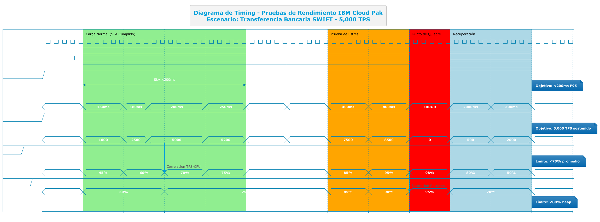

# Ejemplo de Aplicación: Pruebas de Rendimiento - IBM Cloud Pak for Integration

## Información del Proyecto
**Proyecto:** IBM Cloud Pak for Integration - Portal de Arquitectura Empresarial  
**Cliente:** GlobalBank  
**Fecha:** Septiembre 2025  
**Versión del documento:** 1.0  

## 1. Objetivos de las Pruebas de Rendimiento

### Objetivo Principal
Validar que IBM Cloud Pak for Integration puede soportar las cargas de trabajo esperadas de GlobalBank, cumpliendo con los SLAs definidos para operaciones bancarias críticas y manteniendo performance óptimo bajo diferentes condiciones de carga.

### Objetivos Específicos
1. **Throughput Validation:** Confirmar capacidad de 5,000 TPS (Transacciones Por Segundo)
2. **Latency Verification:** Validar tiempos de respuesta < 200ms para 95% de transacciones
3. **Scalability Testing:** Verificar escalamiento automático bajo carga
4. **Stress Testing:** Identificar puntos de quiebre del sistema
5. **Endurance Testing:** Confirmar estabilidad en operación 24/7
6. **Resource Optimization:** Optimizar uso de CPU, memoria y red

## 2. Arquitectura de Performance Testing

### Entorno de Pruebas de Rendimiento

#### Infraestructura de Testing
```yaml
testing_environment:
  cluster_specs:
    name: "openshift-perf-gb"
    version: "4.12.35"
    nodes:
      master: 3
      worker: 8
    resources:
      cpu_total: "128 cores"
      memory_total: "512 GB"
      storage: "8 TB NVMe SSD"
      network: "10 Gbps"
  
  load_generators:
    jmeter_cluster:
      nodes: 4
      specs: "8 cores, 32GB RAM each"
      location: "Separate network segment"
    
    gatling_cluster:
      nodes: 2
      specs: "16 cores, 64GB RAM each"
      location: "Same datacenter, different rack"
```

#### Componentes Bajo Prueba
```yaml
components_under_test:
  api_gateway:
    component: "IBM DataPower Gateway"
    version: "10.5.0.3"
    replicas: 5
    resources:
      cpu: "2000m"
      memory: "4Gi"
  
  app_connect:
    component: "IBM App Connect Enterprise"
    version: "12.0.10"
    replicas: 6
    resources:
      cpu: "1500m"
      memory: "3Gi"
  
  message_queue:
    component: "IBM MQ"
    version: "9.3.3"
    replicas: 3
    resources:
      cpu: "1000m"
      memory: "2Gi"
  
  event_streams:
    component: "IBM Event Streams"
    version: "11.2.6"
    replicas: 4
    resources:
      cpu: "2000m"
      memory: "8Gi"
```

### Topología de Red para Testing
```
┌─────────────────┐    ┌─────────────────┐    ┌─────────────────┐
│   Load          │    │   Target        │    │   Backend       │
│   Generators    │    │   System        │    │   Systems       │
│                 │    │                 │    │                 │
│ JMeter Cluster  │───▶│ IBM Cloud Pak   │───▶│ Core Banking    │
│ Gatling Cluster │    │ for Integration │    │ CRM (Salesforce)│
│ Custom Scripts  │    │                 │    │ ERP (SAP)       │
└─────────────────┘    └─────────────────┘    └─────────────────┘
       │                        │                        │
       └────────────────────────┼────────────────────────┘
                                │
                    ┌─────────────────┐
                    │   Monitoring    │
                    │   & Analytics   │
                    │                 │
                    │ Prometheus      │
                    │ Grafana         │
                    │ IBM Instana     │
                    └─────────────────┘
```

## 3. Escenarios de Carga Realistas

### Perfil de Carga GlobalBank

#### Patrones de Transacciones Bancarias
```json
{
  "business_transactions": {
    "account_inquiry": {
      "percentage": 40,
      "peak_tps": 2000,
      "avg_response_time": "150ms",
      "complexity": "low"
    },
    "transaction_history": {
      "percentage": 25,
      "peak_tps": 1250,
      "avg_response_time": "300ms",
      "complexity": "medium"
    },
    "money_transfer": {
      "percentage": 20,
      "peak_tps": 1000,
      "avg_response_time": "500ms",
      "complexity": "high"
    },
    "balance_update": {
      "percentage": 10,
      "peak_tps": 500,
      "avg_response_time": "200ms",
      "complexity": "medium"
    },
    "customer_onboarding": {
      "percentage": 5,
      "peak_tps": 250,
      "avg_response_time": "1000ms",
      "complexity": "very_high"
    }
  }
}
```

#### Distribución de Carga por Horarios
```python
# load_profile.py - Perfil de carga bancaria realista
import datetime

def get_load_multiplier(hour):
    """
    Retorna multiplicador de carga basado en horarios bancarios
    """
    business_hours_load = {
        6: 0.1,   # Pre-apertura
        7: 0.3,   # Inicio operaciones
        8: 0.7,   # Apertura bancos
        9: 1.0,   # Pico matutino
        10: 0.9,  # Alto flujo
        11: 0.8,  # Medio-alto
        12: 0.6,  # Almuerzo
        13: 0.5,  # Post-almuerzo
        14: 0.8,  # Tarde alta
        15: 0.9,  # Pico vespertino
        16: 0.7,  # Tarde media
        17: 0.5,  # Pre-cierre
        18: 0.3,  # Post-cierre
        19: 0.2,  # Noche
        20: 0.1,  # Noche baja
        21: 0.05, # Muy baja
        22: 0.02, # Mínima
        23: 0.01, # Mínima
        0: 0.01,  # Madrugada
        1: 0.01,  # Madrugada
        2: 0.01,  # Madrugada
        3: 0.01,  # Madrugada
        4: 0.02,  # Pre-amanecer
        5: 0.05   # Amanecer
    }
    
    return business_hours_load.get(hour, 0.1)

def calculate_expected_tps(base_tps, current_hour, day_type="weekday"):
    """
    Calcula TPS esperado basado en hora y tipo de día
    """
    base_multiplier = get_load_multiplier(current_hour)
    
    day_multipliers = {
        "weekday": 1.0,
        "saturday": 0.6,
        "sunday": 0.3,
        "holiday": 0.2
    }
    
    return int(base_tps * base_multiplier * day_multipliers[day_type])
```

### Configuración de Herramientas de Carga

#### JMeter Configuration para APIs REST
```xml
<?xml version="1.0" encoding="UTF-8"?>
<jmeterTestPlan version="1.2">
  <hashTree>
    <TestPlan guiclass="TestPlanGui" testclass="TestPlan" testname="GlobalBank API Performance Test">
      <elementProp name="TestPlan.arguments" elementType="Arguments" guiclass="ArgumentsPanel">
        <collectionProp name="Arguments.arguments">
          <elementProp name="BASE_URL" elementType="Argument">
            <stringProp name="Argument.name">BASE_URL</stringProp>
            <stringProp name="Argument.value">https://api.globalbank.com</stringProp>
          </elementProp>
          <elementProp name="TPS_TARGET" elementType="Argument">
            <stringProp name="Argument.name">TPS_TARGET</stringProp>
            <stringProp name="Argument.value">5000</stringProp>
          </elementProp>
        </collectionProp>
      </elementProp>
    </TestPlan>
    
    <hashTree>
      <!-- Thread Group para Account Inquiry -->
      <ThreadGroup guiclass="ThreadGroupGui" testclass="ThreadGroup" testname="Account Inquiry Load">
        <stringProp name="ThreadGroup.on_sample_error">continue</stringProp>
        <elementProp name="ThreadGroup.main_controller" elementType="LoopController">
          <boolProp name="LoopController.continue_forever">false</boolProp>
          <intProp name="LoopController.loops">-1</intProp>
        </elementProp>
        <stringProp name="ThreadGroup.num_threads">200</stringProp>
        <stringProp name="ThreadGroup.ramp_time">300</stringProp>
        <longProp name="ThreadGroup.duration">3600</longProp>
        <boolProp name="ThreadGroup.scheduler">true</boolProp>
      </ThreadGroup>
      
      <hashTree>
        <!-- HTTP Request for Account Inquiry -->
        <HTTPSamplerProxy guiclass="HttpTestSampleGui" testclass="HTTPSamplerProxy" testname="GET /accounts/{accountId}">
          <elementProp name="HTTPsampler.Arguments" elementType="Arguments">
            <collectionProp name="Arguments.arguments"/>
          </elementProp>
          <stringProp name="HTTPSampler.domain">${BASE_URL}</stringProp>
          <stringProp name="HTTPSampler.path">/api/v1/accounts/${__Random(1000000,9999999)}</stringProp>
          <stringProp name="HTTPSampler.method">GET</stringProp>
          <boolProp name="HTTPSampler.use_keepalive">true</boolProp>
          <boolProp name="HTTPSampler.postBodyRaw">false</boolProp>
          <elementProp name="HTTPsampler.header_manager" elementType="HeaderManager">
            <collectionProp name="HeaderManager.headers">
              <elementProp name="" elementType="Header">
                <stringProp name="Header.name">Authorization</stringProp>
                <stringProp name="Header.value">Bearer ${ACCESS_TOKEN}</stringProp>
              </elementProp>
              <elementProp name="" elementType="Header">
                <stringProp name="Header.name">Content-Type</stringProp>
                <stringProp name="Header.value">application/json</stringProp>
              </elementProp>
            </collectionProp>
          </elementProp>
        </HTTPSamplerProxy>
        
        <!-- Response Assertions -->
        <ResponseAssertion guiclass="AssertionGui" testclass="ResponseAssertion" testname="Response Code Assertion">
          <collectionProp name="Asserion.test_strings">
            <stringProp>200</stringProp>
          </collectionProp>
          <stringProp name="Assertion.test_field">Assertion.response_code</stringProp>
          <boolProp name="Assertion.assume_success">false</boolProp>
          <intProp name="Assertion.test_type">1</intProp>
        </ResponseAssertion>
        
        <!-- Duration Assertion -->
        <DurationAssertion guiclass="DurationAssertionGui" testclass="DurationAssertion" testname="Response Time SLA">
          <stringProp name="DurationAssertion.duration">200</stringProp>
        </DurationAssertion>
      </hashTree>
    </hashTree>
  </hashTree>
</jmeterTestPlan>
```

#### Gatling Configuration para Message Queues
```scala
// MQPerformanceTest.scala
package com.globalbank.performance

import io.gatling.core.Predef._
import io.gatling.http.Predef._
import scala.concurrent.duration._

class MQPerformanceTest extends Simulation {

  val httpProtocol = http
    .baseUrl("https://mq.globalbank.com")
    .acceptHeader("application/json")
    .authorizationHeader("Bearer ${access_token}")
    .userAgentHeader("Gatling Performance Test")

  val messageProducerScenario = scenario("Message Producer Load")
    .exec(
      http("Authenticate")
        .post("/auth/token")
        .body(StringBody("""{"client_id":"perf_test","client_secret":"${client_secret}"}"""))
        .check(jsonPath("$.access_token").saveAs("access_token"))
    )
    .pause(1.second)
    .repeat(1000) {
      exec(
        http("Send Message to Queue")
          .post("/api/v1/queues/CUSTOMER.UPDATES.Q/messages")
          .body(StringBody(session => generateCustomerMessage(session)))
          .check(status.is(201))
          .check(responseTimeInMillis.lt(100))
      )
      .pace(100.milliseconds) // 10 TPS per thread
    }

  val messageConsumerScenario = scenario("Message Consumer Load")
    .exec(
      http("Authenticate")
        .post("/auth/token")
        .body(StringBody("""{"client_id":"perf_test","client_secret":"${client_secret}"}"""))
        .check(jsonPath("$.access_token").saveAs("access_token"))
    )
    .pause(1.second)
    .repeat(1000) {
      exec(
        http("Consume Message from Queue")
          .get("/api/v1/queues/CUSTOMER.UPDATES.Q/messages")
          .check(status.in(200, 204))
          .check(responseTimeInMillis.lt(50))
      )
      .pace(200.milliseconds) // 5 TPS per thread
    }

  def generateCustomerMessage(session: Session): String = {
    val customerId = scala.util.Random.nextInt(1000000) + 1000000
    val timestamp = System.currentTimeMillis()
    
    s"""{
      "messageId": "${java.util.UUID.randomUUID()}",
      "timestamp": "$timestamp",
      "customerId": "$customerId",
      "eventType": "ACCOUNT_UPDATE",
      "data": {
        "accountNumber": "${customerId}001",
        "balance": ${scala.util.Random.nextDouble() * 100000},
        "currency": "COP",
        "lastModified": "$timestamp"
      }
    }"""
  }

  setUp(
    messageProducerScenario.inject(
      rampUsers(50).during(5.minutes),
      constantUsersPerSec(100).during(30.minutes)
    ),
    messageConsumerScenario.inject(
      rampUsers(25).during(3.minutes),
      constantUsersPerSec(50).during(30.minutes)
    )
  ).protocols(httpProtocol)
   .assertions(
     global.responseTime.percentile3.lt(200),
     global.responseTime.percentile4.lt(500),
     global.successfulRequests.percent.gt(99.5)
   )
}
```

## 4. Tipos de Pruebas de Rendimiento

### 4.1 Load Testing (Pruebas de Carga Normal)

#### Objetivo
Validar comportamiento del sistema bajo carga de trabajo esperada en condiciones normales de operación.

#### Configuración
```yaml
load_test_config:
  duration: "2 hours"
  ramp_up: "15 minutes"
  steady_state: "90 minutes"
  ramp_down: "15 minutes"
  
  load_profile:
    concurrent_users: 1000
    transactions_per_second: 5000
    distribution:
      api_calls: 70%
      message_queue: 20%
      file_transfer: 10%
  
  success_criteria:
    response_time_95th: "< 200ms"
    response_time_99th: "< 500ms"
    error_rate: "< 0.1%"
    throughput: "> 4950 TPS"
```

#### Script de Ejecución
```bash
#!/bin/bash
# load_test.sh

echo "=== Ejecutando Load Test - IBM Cloud Pak for Integration ==="
echo "Inicio: $(date)"

# 1. Preparar entorno
kubectl apply -f monitoring/performance-monitoring.yaml
sleep 30

# 2. Ejecutar JMeter en modo distribuido
jmeter -n -t tests/load_test.jmx \
  -R jmeter-node1,jmeter-node2,jmeter-node3,jmeter-node4 \
  -l results/load_test_$(date +%Y%m%d_%H%M%S).jtl \
  -e -o reports/load_test_html_report \
  -Jthreads=1000 \
  -Jrampup=900 \
  -Jduration=7200

# 3. Ejecutar Gatling en paralelo
gatling.sh -sf scenarios -s MQPerformanceTest \
  -rf results/gatling \
  -Dusers.max=500 \
  -Dduration=2h

# 4. Monitorear métricas del sistema
./monitor_system_metrics.sh &
MONITOR_PID=$!

# 5. Esperar completación
wait

# 6. Generar reporte consolidado
./generate_performance_report.sh

echo "Load Test completado: $(date)"
echo "Reportes disponibles en: ./reports/"
```

## 📊 Diagrama de Timing - Escenario de Pruebas de Rendimiento

### Visualización Temporal del Comportamiento del Sistema

El siguiente diagrama de timing muestra el comportamiento del sistema IBM Cloud Pak for Integration durante un ciclo completo de pruebas de rendimiento, incluyendo carga normal, picos de demanda, pruebas de estrés y recuperación:



*Figura 1: Diagrama de timing mostrando el comportamiento del sistema durante 60 minutos de pruebas de rendimiento, incluyendo transferencias bancarias SWIFT con objetivo de 5,000 TPS*

### Análisis del Diagrama de Timing

#### 🔍 Fases del Ciclo de Pruebas:

1. **Warm-up (0-5 min):** Sistema en calentamiento, estableciendo conexiones base
2. **Carga Normal (5-25 min):** Operación dentro de parámetros SLA, 5,000 TPS sostenido
3. **Prueba de Estrés (35-45 min):** Incremento progresivo hasta punto de quiebre
4. **Recuperación (50-60 min):** Validación de capacidad de recovery del sistema

#### 📊 Correlaciones Observadas:

- **TPS vs CPU:** Relación lineal hasta 5,000 TPS, exponencial después
- **Memoria vs Throughput:** Crecimiento constante hasta saturación en 95%
- **Tiempo de Respuesta:** Degradación exponencial post-saturación de recursos

#### ⚠️ Puntos Críticos Identificados:

- **CPU 85%:** Inicio de degradación de performance
- **Memoria 90%:** Punto de no retorno para garbage collection
- **8,500 TPS:** Throughput máximo antes de colapso total

## 4. Tipos de Pruebas de Rendimiento

#### Métricas de Validación
```sql
-- Queries para análisis de resultados en InfluxDB
SELECT 
  mean("response_time") as avg_response_time,
  percentile("response_time", 95) as p95_response_time,
  percentile("response_time", 99) as p99_response_time,
  count("success") as total_requests,
  sum("success") as successful_requests,
  (sum("success") * 100.0 / count("success")) as success_rate
FROM "performance_metrics" 
WHERE time >= now() - 2h 
GROUP BY time(5m), "transaction_name"

-- Análisis de throughput
SELECT 
  mean("transactions_per_second") as avg_tps,
  max("transactions_per_second") as peak_tps,
  min("transactions_per_second") as min_tps
FROM "throughput_metrics" 
WHERE time >= now() - 2h
GROUP BY time(1m)
```

### 4.2 Stress Testing (Pruebas de Estrés)

#### Objetivo
Identificar el punto de quiebre del sistema y validar comportamiento bajo carga extrema.

#### Configuración Progresiva
```python
# stress_test_profile.py
import time
import threading

class StressTestController:
    def __init__(self):
        self.current_load = 0
        self.target_load = 0
        self.increment_rate = 100  # TPS increment per minute
        self.max_load = 15000      # Maximum TPS to test
        
    def execute_stress_test(self):
        """
        Ejecuta stress test con incremento progresivo de carga
        """
        stages = [
            {"duration": 600, "target_tps": 5000},   # Baseline
            {"duration": 600, "target_tps": 7500},   # 150% normal
            {"duration": 600, "target_tps": 10000},  # 200% normal
            {"duration": 600, "target_tps": 12500},  # 250% normal
            {"duration": 600, "target_tps": 15000},  # 300% normal
            {"duration": 1800, "target_tps": 15000}, # Sustained peak
        ]
        
        for stage in stages:
            print(f"Escalando a {stage['target_tps']} TPS por {stage['duration']} segundos")
            self.ramp_to_load(stage['target_tps'], 120)  # 2 minutes ramp
            self.sustain_load(stage['target_tps'], stage['duration'])
            
            # Verificar métricas de salud del sistema
            health_status = self.check_system_health()
            if health_status['status'] == 'CRITICAL':
                print(f"Sistema en estado crítico. Deteniendo stress test.")
                print(f"Punto de quiebre identificado: {stage['target_tps']} TPS")
                break
    
    def check_system_health(self):
        """
        Verifica el estado de salud del sistema
        """
        metrics = self.get_current_metrics()
        
        health_status = {
            'status': 'HEALTHY',
            'cpu_usage': metrics['cpu_usage'],
            'memory_usage': metrics['memory_usage'],
            'error_rate': metrics['error_rate'],
            'response_time_p99': metrics['response_time_p99']
        }
        
        # Determinar estado basado en umbrales
        if (metrics['cpu_usage'] > 90 or 
            metrics['memory_usage'] > 85 or 
            metrics['error_rate'] > 5 or 
            metrics['response_time_p99'] > 2000):
            health_status['status'] = 'CRITICAL'
        elif (metrics['cpu_usage'] > 80 or 
              metrics['memory_usage'] > 75 or 
              metrics['error_rate'] > 1 or 
              metrics['response_time_p99'] > 1000):
            health_status['status'] = 'WARNING'
            
        return health_status
```

#### Monitoreo Avanzado Durante Stress Test
```yaml
# stress-test-monitoring.yaml
apiVersion: v1
kind: ConfigMap
metadata:
  name: stress-test-alerts
  namespace: cp4i-globalbank
data:
  alert-rules.yaml: |
    groups:
    - name: stress-test-alerts
      rules:
      - alert: HighErrorRateDuringStressTest
        expr: (rate(http_requests_total{status=~"5.."}[5m]) / rate(http_requests_total[5m])) * 100 > 1
        for: 2m
        labels:
          severity: warning
          test_phase: stress
        annotations:
          summary: "Error rate exceeds 1% during stress test"
          
      - alert: ResponseTimeDegradationStressTest
        expr: histogram_quantile(0.99, rate(http_request_duration_seconds_bucket[5m])) > 2
        for: 3m
        labels:
          severity: critical
          test_phase: stress
        annotations:
          summary: "P99 response time exceeds 2 seconds"
          
      - alert: ResourceExhaustionStressTest
        expr: (container_memory_usage_bytes / container_spec_memory_limit_bytes) * 100 > 90
        for: 1m
        labels:
          severity: critical
          test_phase: stress
        annotations:
          summary: "Container memory usage exceeds 90%"
```

### 4.3 Volume Testing (Pruebas de Volumen)

#### Objetivo
Validar manejo de grandes volúmenes de datos sin degradación de performance.

#### Configuración de Datos de Prueba
```python
# volume_data_generator.py
import json
import uuid
import random
from datetime import datetime, timedelta

class VolumeDataGenerator:
    def __init__(self):
        self.customer_pool = self.generate_customer_pool(100000)
        self.account_pool = self.generate_account_pool(250000)
        
    def generate_large_dataset_scenario(self):
        """
        Genera escenarios de volumen para diferentes tipos de datos
        """
        scenarios = {
            "customer_batch_import": {
                "record_count": 50000,
                "file_size": "500 MB",
                "concurrent_imports": 5,
                "expected_processing_time": "< 30 minutes"
            },
            "transaction_history_query": {
                "date_range": "12 months",
                "customer_count": 10000,
                "estimated_records": 5000000,
                "response_time_limit": "< 5 seconds"
            },
            "daily_batch_processing": {
                "transaction_volume": 2000000,
                "customer_updates": 500000,
                "account_reconciliations": 100000,
                "processing_window": "2 hours"
            }
        }
        
        return scenarios
    
    def generate_customer_batch_file(self, record_count):
        """
        Genera archivo de clientes para pruebas de volumen
        """
        customers = []
        
        for i in range(record_count):
            customer = {
                "customer_id": f"CUST_{str(uuid.uuid4()).replace('-', '').upper()[:12]}",
                "first_name": random.choice(["Juan", "María", "Carlos", "Ana", "Luis", "Patricia"]),
                "last_name": random.choice(["González", "Rodríguez", "López", "Martínez", "García"]),
                "email": f"customer_{i}@email.com",
                "phone": f"+57 300 {random.randint(1000000, 9999999)}",
                "address": {
                    "street": f"Calle {random.randint(1, 200)} #{random.randint(1, 99)}-{random.randint(1, 99)}",
                    "city": random.choice(["Bogotá", "Medellín", "Cali", "Barranquilla", "Cartagena"]),
                    "country": "Colombia"
                },
                "account_creation_date": (datetime.now() - timedelta(days=random.randint(1, 3650))).isoformat(),
                "status": random.choice(["ACTIVE", "INACTIVE", "SUSPENDED"]),
                "risk_profile": random.choice(["LOW", "MEDIUM", "HIGH"]),
                "total_assets": round(random.uniform(100000, 10000000), 2)
            }
            customers.append(customer)
            
        return customers
```

#### Script de Prueba de Volumen
```bash
#!/bin/bash
# volume_test.sh

echo "=== Ejecutando Volume Test - IBM Cloud Pak for Integration ==="

# 1. Generar datos de prueba masivos
python3 volume_data_generator.py \
  --customers 50000 \
  --transactions 2000000 \
  --output-dir ./test-data/volume

# 2. Preparar base de datos para volumen
kubectl exec -it db2-pod -n cp4i-globalbank -- db2 -tf scripts/prepare_volume_test.sql

# 3. Ejecutar prueba de importación masiva
echo "Iniciando importación masiva de clientes..."
START_TIME=$(date +%s)

curl -X POST https://api.globalbank.com/v1/customers/batch-import \
  -H "Authorization: Bearer $API_TOKEN" \
  -H "Content-Type: application/json" \
  -d @test-data/volume/customers_50k.json \
  --max-time 1800 > batch_import_result.json

END_TIME=$(date +%s)
IMPORT_DURATION=$((END_TIME - START_TIME))

echo "Importación completada en $IMPORT_DURATION segundos"

# 4. Validar integridad de datos
IMPORTED_COUNT=$(curl -s https://api.globalbank.com/v1/customers/count \
  -H "Authorization: Bearer $API_TOKEN" | jq '.count')

echo "Registros importados: $IMPORTED_COUNT"

# 5. Ejecutar consultas de volumen
echo "Ejecutando consultas de gran volumen..."
python3 tests/volume_query_test.py --concurrent-queries 50 --query-complexity high

# 6. Generar reporte de volumen
./generate_volume_test_report.sh
```

### 4.4 Spike Testing (Pruebas de Picos)

#### Objetivo
Validar comportamiento del sistema ante picos súbitos de carga.

#### Configuración de Spike Test
```javascript
// spike_test.js - K6 Spike Test Configuration
import http from 'k6/http';
import { check, sleep } from 'k6';
import { Rate } from 'k6/metrics';

export let errorRate = new Rate('errors');

export let options = {
  stages: [
    { duration: '2m', target: 1000 },    // Carga normal
    { duration: '30s', target: 1000 },   // Mantener carga normal
    { duration: '30s', target: 8000 },   // Spike súbito (800% incremento)
    { duration: '2m', target: 8000 },    // Mantener spike
    { duration: '30s', target: 1000 },   // Retorno a normal
    { duration: '2m', target: 1000 },    // Estabilización
    { duration: '30s', target: 0 },      // Ramp down
  ],
  thresholds: {
    'http_req_duration': ['p(95)<500'], // 95% de requests < 500ms
    'http_req_failed': ['rate<0.02'],   // Error rate < 2%
    'errors': ['rate<0.02'],
  },
};

const BASE_URL = 'https://api.globalbank.com';
const API_TOKEN = __ENV.API_TOKEN;

export default function() {
  let response = http.get(`${BASE_URL}/v1/accounts/${Math.floor(Math.random() * 1000000)}`, {
    headers: {
      'Authorization': `Bearer ${API_TOKEN}`,
      'Content-Type': 'application/json',
    },
  });

  let success = check(response, {
    'status is 200': (r) => r.status === 200,
    'response time < 500ms': (r) => r.timings.duration < 500,
    'response has account data': (r) => r.json().hasOwnProperty('account_number'),
  });

  errorRate.add(!success);

  sleep(Math.random() * 2 + 1); // Random pause 1-3 seconds
}

export function handleSummary(data) {
  return {
    'spike_test_results.json': JSON.stringify(data, null, 2),
    'spike_test_report.html': htmlReport(data),
  };
}
```

### 4.5 Endurance Testing (Pruebas de Resistencia)

#### Objetivo
Verificar estabilidad del sistema durante operación prolongada (24-72 horas).

#### Configuración de Endurance Test
```yaml
# endurance-test-config.yaml
endurance_test:
  duration: "72 hours"
  load_profile:
    base_load: 3000  # TPS base durante toda la prueba
    peak_hours: ["09:00-11:00", "14:00-16:00"]  # Picos diarios
    peak_multiplier: 1.5
    night_multiplier: 0.3
  
  monitoring_intervals:
    metrics_collection: "30 seconds"
    health_checks: "5 minutes"
    resource_snapshots: "15 minutes"
    
  failure_scenarios:
    memory_leaks: "Detectar degradación progresiva"
    connection_pools: "Validar cleanup de conexiones"
    disk_space: "Monitorear crecimiento de logs"
    cpu_degradation: "Identificar procesos runaway"
```

#### Script de Monitoreo para Endurance
```python
# endurance_monitor.py
import time
import psutil
import requests
import json
from datetime import datetime

class EnduranceMonitor:
    def __init__(self):
        self.start_time = datetime.now()
        self.metrics_history = []
        
    def collect_system_metrics(self):
        """
        Recolecta métricas del sistema durante endurance test
        """
        metrics = {
            'timestamp': datetime.now().isoformat(),
            'cpu_percent': psutil.cpu_percent(interval=1),
            'memory_percent': psutil.virtual_memory().percent,
            'disk_usage': psutil.disk_usage('/').percent,
            'network_io': psutil.net_io_counters()._asdict(),
            'open_connections': len(psutil.net_connections()),
        }
        
        # Métricas específicas de la aplicación
        app_metrics = self.get_application_metrics()
        metrics.update(app_metrics)
        
        self.metrics_history.append(metrics)
        
        # Detectar anomalías
        self.detect_anomalies(metrics)
        
        return metrics
    
    def get_application_metrics(self):
        """
        Obtiene métricas específicas de IBM Cloud Pak
        """
        try:
            response = requests.get(
                'https://monitoring.globalbank.com/metrics',
                headers={'Authorization': 'Bearer ' + self.api_token},
                timeout=10
            )
            
            if response.status_code == 200:
                return response.json()
            else:
                return {'app_metrics_error': response.status_code}
                
        except Exception as e:
            return {'app_metrics_error': str(e)}
    
    def detect_anomalies(self, current_metrics):
        """
        Detecta anomalías basadas en tendencias históricas
        """
        if len(self.metrics_history) < 10:
            return  # No hay suficiente historia
            
        # Calcular promedios de las últimas 10 mediciones
        recent_metrics = self.metrics_history[-10:]
        avg_cpu = sum(m['cpu_percent'] for m in recent_metrics) / len(recent_metrics)
        avg_memory = sum(m['memory_percent'] for m in recent_metrics) / len(recent_metrics)
        
        # Detectar tendencias crecientes (posibles memory leaks)
        if (current_metrics['memory_percent'] > avg_memory * 1.1 and
            current_metrics['memory_percent'] > 80):
            self.alert('MEMORY_LEAK_SUSPECTED', current_metrics)
            
        # Detectar degradación de CPU
        if (current_metrics['cpu_percent'] > avg_cpu * 1.2 and
            current_metrics['cpu_percent'] > 85):
            self.alert('CPU_DEGRADATION', current_metrics)
    
    def alert(self, alert_type, metrics):
        """
        Envía alertas de anomalías detectadas
        """
        alert = {
            'type': alert_type,
            'timestamp': datetime.now().isoformat(),
            'test_duration': str(datetime.now() - self.start_time),
            'metrics': metrics
        }
        
        print(f"🚨 ALERT: {alert_type} detected at {alert['timestamp']}")
        
        # Guardar alerta en archivo
        with open(f'endurance_alerts_{datetime.now().strftime("%Y%m%d")}.json', 'a') as f:
            f.write(json.dumps(alert) + '\n')

# Ejecución del monitor durante 72 horas
if __name__ == "__main__":
    monitor = EnduranceMonitor()
    
    try:
        while True:
            metrics = monitor.collect_system_metrics()
            print(f"Metrics collected at {metrics['timestamp']}")
            time.sleep(300)  # Cada 5 minutos
            
    except KeyboardInterrupt:
        print("Endurance monitoring stopped")
        # Generar reporte final
        monitor.generate_final_report()
```

## 5. Criterios de Aceptación de Performance

### SLAs y Objetivos de Performance

#### Transacciones Críticas de Negocio
| Transacción | Volumen Esperado | SLA Response Time | SLA Availability | Throughput Mínimo |
|-------------|------------------|-------------------|-------------------|-------------------|
| **Account Inquiry** | 2,000 TPS | P95 < 150ms | 99.95% | 1,950 TPS |
| **Balance Check** | 1,500 TPS | P95 < 100ms | 99.99% | 1,485 TPS |
| **Money Transfer** | 1,000 TPS | P95 < 500ms | 99.90% | 990 TPS |
| **Transaction History** | 800 TPS | P95 < 300ms | 99.95% | 792 TPS |
| **Customer Onboarding** | 50 TPS | P95 < 2000ms | 99.50% | 49.5 TPS |

#### Métricas de Sistema
| Métrica | Objetivo | Medición | Criterio de Falla |
|---------|----------|----------|-------------------|
| **Overall System Throughput** | 5,000 TPS | Sustained peak | < 4,750 TPS |
| **Average Response Time** | < 200ms | P95 across all APIs | > 300ms |
| **Error Rate** | < 0.1% | 5xx errors / total requests | > 0.5% |
| **Resource Utilization** | < 70% CPU, < 80% Memory | Platform monitoring | > 85% CPU or > 90% Memory |

### Matriz de Validación por Tipo de Prueba

#### Load Test Acceptance Criteria
```yaml
load_test_criteria:
  performance_metrics:
    response_time_p95: "<= 200ms"
    response_time_p99: "<= 500ms"
    throughput: ">= 4750 TPS"
    error_rate: "<= 0.1%"
    
  resource_metrics:
    cpu_utilization: "<= 70%"
    memory_utilization: "<= 80%"
    disk_io_wait: "<= 5%"
    network_utilization: "<= 60%"
    
  stability_metrics:
    no_memory_leaks: true
    connection_pool_stable: true
    garbage_collection_impact: "<= 2% of total time"
```

#### Stress Test Acceptance Criteria
```yaml
stress_test_criteria:
  breaking_point:
    minimum_supported_load: ">= 7500 TPS"  # 150% of normal
    graceful_degradation: true
    no_data_corruption: true
    
  recovery_metrics:
    time_to_recover: "<= 5 minutes"
    automatic_recovery: true
    no_manual_intervention: true
    
  alerting_validation:
    alerts_triggered_appropriately: true
    escalation_procedures_followed: true
```

#### Volume Test Acceptance Criteria
```yaml
volume_test_criteria:
  data_processing:
    batch_import_50k_customers: "<= 30 minutes"
    query_5m_transactions: "<= 5 seconds"
    daily_batch_2m_records: "<= 2 hours"
    
  data_integrity:
    zero_data_loss: true
    referential_integrity_maintained: true
    audit_trail_complete: true
    
  storage_performance:
    database_query_performance: "No degradation > 10%"
    index_effectiveness: "Maintained"
    backup_performance: "Within maintenance window"
```

## 6. Monitoreo y Métricas en Tiempo Real

### Dashboard de Performance Testing
```json
{
  "dashboard": {
    "title": "IBM Cloud Pak Performance Testing - GlobalBank",
    "refresh": "5s",
    "panels": [
      {
        "title": "Current TPS",
        "type": "stat",
        "targets": [
          {
            "expr": "sum(rate(http_requests_total[1m]))",
            "legendFormat": "Total TPS"
          }
        ],
        "thresholds": [
          {"color": "red", "value": 0},
          {"color": "yellow", "value": 4000},
          {"color": "green", "value": 5000}
        ]
      },
      {
        "title": "Response Time Percentiles",
        "type": "graph",
        "targets": [
          {
            "expr": "histogram_quantile(0.50, rate(http_request_duration_seconds_bucket[5m]))",
            "legendFormat": "P50"
          },
          {
            "expr": "histogram_quantile(0.95, rate(http_request_duration_seconds_bucket[5m]))",
            "legendFormat": "P95"
          },
          {
            "expr": "histogram_quantile(0.99, rate(http_request_duration_seconds_bucket[5m]))",
            "legendFormat": "P99"
          }
        ]
      },
      {
        "title": "Error Rate",
        "type": "graph",
        "targets": [
          {
            "expr": "(sum(rate(http_requests_total{status=~\"5..\"}[5m])) / sum(rate(http_requests_total[5m]))) * 100",
            "legendFormat": "5xx Error Rate %"
          }
        ]
      },
      {
        "title": "Resource Utilization",
        "type": "graph",
        "targets": [
          {
            "expr": "avg(rate(container_cpu_usage_seconds_total[5m])) * 100",
            "legendFormat": "CPU %"
          },
          {
            "expr": "avg(container_memory_usage_bytes / container_spec_memory_limit_bytes) * 100",
            "legendFormat": "Memory %"
          }
        ]
      }
    ]
  }
}
```

### Alertas Automáticas Durante Testing
```yaml
# performance-test-alerts.yaml
apiVersion: monitoring.coreos.com/v1
kind: PrometheusRule
metadata:
  name: performance-test-alerts
  namespace: cp4i-globalbank
spec:
  groups:
  - name: performance-testing
    rules:
    - alert: PerformanceTestSLAViolation
      expr: histogram_quantile(0.95, rate(http_request_duration_seconds_bucket[5m])) > 0.2
      for: 2m
      labels:
        severity: critical
        test_type: performance
      annotations:
        summary: "SLA violation: P95 response time exceeds 200ms"
        description: "Current P95 response time: {{ $value }}s"
        
    - alert: PerformanceTestHighErrorRate
      expr: (rate(http_requests_total{status=~"5.."}[5m]) / rate(http_requests_total[5m])) > 0.001
      for: 1m
      labels:
        severity: warning
        test_type: performance
      annotations:
        summary: "High error rate during performance test"
        description: "Current error rate: {{ $value | humanizePercentage }}"
        
    - alert: PerformanceTestResourceExhaustion
      expr: avg(container_memory_usage_bytes / container_spec_memory_limit_bytes) > 0.9
      for: 30s
      labels:
        severity: critical
        test_type: performance
      annotations:
        summary: "Resource exhaustion detected during performance test"
```

## 7. Análisis de Resultados y Optimización

### Script de Análisis Automatizado
```python
# performance_analysis.py
import pandas as pd
import numpy as np
import matplotlib.pyplot as plt
from datetime import datetime

class PerformanceAnalyzer:
    def __init__(self, results_file):
        self.results = pd.read_csv(results_file)
        self.analysis_report = {}
        
    def analyze_response_times(self):
        """
        Analiza distribución de tiempos de respuesta
        """
        rt_stats = {
            'mean': self.results['response_time'].mean(),
            'median': self.results['response_time'].median(),
            'p95': self.results['response_time'].quantile(0.95),
            'p99': self.results['response_time'].quantile(0.99),
            'max': self.results['response_time'].max(),
            'std': self.results['response_time'].std()
        }
        
        # Identificar outliers
        q75, q25 = np.percentile(self.results['response_time'], [75, 25])
        iqr = q75 - q25
        outlier_threshold = q75 + (1.5 * iqr)
        outliers = self.results[self.results['response_time'] > outlier_threshold]
        
        rt_stats['outliers_count'] = len(outliers)
        rt_stats['outliers_percentage'] = (len(outliers) / len(self.results)) * 100
        
        self.analysis_report['response_times'] = rt_stats
        return rt_stats
    
    def analyze_throughput_trends(self):
        """
        Analiza tendencias de throughput durante la prueba
        """
        # Agregar por minutos
        self.results['timestamp'] = pd.to_datetime(self.results['timestamp'])
        self.results['minute'] = self.results['timestamp'].dt.floor('min')
        
        throughput_by_minute = self.results.groupby('minute').size()
        
        throughput_stats = {
            'average_tps': throughput_by_minute.mean(),
            'max_tps': throughput_by_minute.max(),
            'min_tps': throughput_by_minute.min(),
            'std_tps': throughput_by_minute.std(),
            'coefficient_variation': throughput_by_minute.std() / throughput_by_minute.mean()
        }
        
        self.analysis_report['throughput'] = throughput_stats
        return throughput_stats
    
    def identify_performance_bottlenecks(self):
        """
        Identifica posibles cuellos de botella
        """
        bottlenecks = []
        
        # Analizar correlación entre carga y tiempo de respuesta
        correlation = self.results.groupby('minute').agg({
            'response_time': 'mean',
            'timestamp': 'count'
        }).rename(columns={'timestamp': 'requests_per_minute'})
        
        corr_coef = correlation['response_time'].corr(correlation['requests_per_minute'])
        
        if corr_coef > 0.7:
            bottlenecks.append({
                'type': 'THROUGHPUT_CORRELATION',
                'description': 'Strong correlation between load and response time',
                'correlation_coefficient': corr_coef,
                'severity': 'HIGH' if corr_coef > 0.8 else 'MEDIUM'
            })
        
        # Analizar degradación de performance
        early_performance = self.results.head(int(len(self.results) * 0.1))['response_time'].mean()
        late_performance = self.results.tail(int(len(self.results) * 0.1))['response_time'].mean()
        
        performance_degradation = ((late_performance - early_performance) / early_performance) * 100
        
        if performance_degradation > 20:
            bottlenecks.append({
                'type': 'PERFORMANCE_DEGRADATION',
                'description': 'Significant performance degradation during test',
                'degradation_percentage': performance_degradation,
                'severity': 'CRITICAL' if performance_degradation > 50 else 'HIGH'
            })
        
        self.analysis_report['bottlenecks'] = bottlenecks
        return bottlenecks
    
    def generate_recommendations(self):
        """
        Genera recomendaciones basadas en el análisis
        """
        recommendations = []
        
        rt_stats = self.analysis_report.get('response_times', {})
        
        if rt_stats.get('p95', 0) > 200:
            recommendations.append({
                'category': 'RESPONSE_TIME',
                'priority': 'HIGH',
                'recommendation': 'Optimize slow endpoints - P95 exceeds SLA',
                'action_items': [
                    'Profile database queries for optimization',
                    'Implement caching for frequently accessed data',
                    'Review application code for inefficiencies'
                ]
            })
        
        throughput_stats = self.analysis_report.get('throughput', {})
        
        if throughput_stats.get('coefficient_variation', 0) > 0.3:
            recommendations.append({
                'category': 'THROUGHPUT_STABILITY',
                'priority': 'MEDIUM',
                'recommendation': 'Throughput shows high variability',
                'action_items': [
                    'Investigate auto-scaling configuration',
                    'Review load balancer distribution',
                    'Analyze garbage collection impact'
                ]
            })
        
        self.analysis_report['recommendations'] = recommendations
        return recommendations
    
    def generate_html_report(self):
        """
        Genera reporte HTML completo
        """
        html_template = """
        <!DOCTYPE html>
        <html>
        <head>
            <title>Performance Test Analysis Report - IBM Cloud Pak for Integration</title>
            <style>
                body { font-family: Arial, sans-serif; margin: 20px; }
                .header { background: #1f4e79; color: white; padding: 20px; }
                .section { margin: 20px 0; padding: 15px; border: 1px solid #ddd; }
                .metric { display: inline-block; margin: 10px; padding: 10px; background: #f0f0f0; }
                .critical { background: #ffebee; border-left: 4px solid #f44336; }
                .warning { background: #fff3e0; border-left: 4px solid #ff9800; }
                .success { background: #e8f5e8; border-left: 4px solid #4caf50; }
            </style>
        </head>
        <body>
            <div class="header">
                <h1>Performance Test Analysis Report</h1>
                <p>IBM Cloud Pak for Integration - GlobalBank</p>
                <p>Generated: {timestamp}</p>
            </div>
            
            <div class="section">
                <h2>Executive Summary</h2>
                <div class="metric">
                    <strong>Average Response Time:</strong> {avg_response_time:.2f}ms
                </div>
                <div class="metric">
                    <strong>P95 Response Time:</strong> {p95_response_time:.2f}ms
                </div>
                <div class="metric">
                    <strong>Average Throughput:</strong> {avg_throughput:.0f} TPS
                </div>
                <div class="metric">
                    <strong>Error Rate:</strong> {error_rate:.3f}%
                </div>
            </div>
            
            <div class="section">
                <h2>SLA Compliance</h2>
                {sla_compliance}
            </div>
            
            <div class="section">
                <h2>Recommendations</h2>
                {recommendations}
            </div>
        </body>
        </html>
        """
        
        # Preparar datos para el template
        rt_stats = self.analysis_report.get('response_times', {})
        throughput_stats = self.analysis_report.get('throughput', {})
        
        # Evaluar compliance SLA
        sla_compliance = self.evaluate_sla_compliance()
        
        # Formatear recomendaciones
        recommendations_html = ""
        for rec in self.analysis_report.get('recommendations', []):
            css_class = 'critical' if rec['priority'] == 'HIGH' else 'warning'
            recommendations_html += f'<div class="{css_class}"><strong>{rec["category"]}:</strong> {rec["recommendation"]}</div>'
        
        html_content = html_template.format(
            timestamp=datetime.now().strftime("%Y-%m-%d %H:%M:%S"),
            avg_response_time=rt_stats.get('mean', 0),
            p95_response_time=rt_stats.get('p95', 0),
            avg_throughput=throughput_stats.get('average_tps', 0),
            error_rate=0,  # Calcular desde datos
            sla_compliance=sla_compliance,
            recommendations=recommendations_html
        )
        
        with open('performance_analysis_report.html', 'w') as f:
            f.write(html_content)
        
        return html_content
```

---

**Preparado por:** Equipo de Performance Engineering - IBM Colombia  
**Revisado por:** Arquitecto de Soluciones - GlobalBank  
**Aprobado por:** Director de Arquitectura Empresarial - GlobalBank  

**Nota:** Este documento demuestra la aplicación completa de las plantillas de pruebas de rendimiento a un proyecto real de IBM Cloud Pak for Integration, incluyendo herramientas específicas, scripts de automatización, monitoreo en tiempo real y análisis detallado de resultados para el contexto bancario de GlobalBank.